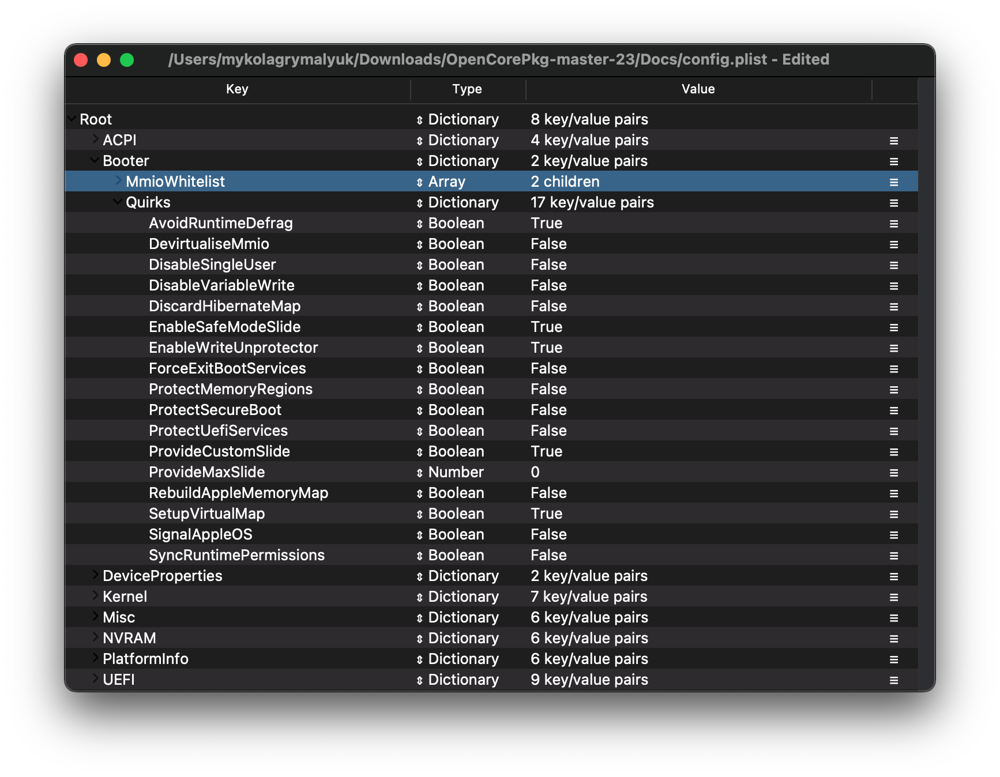
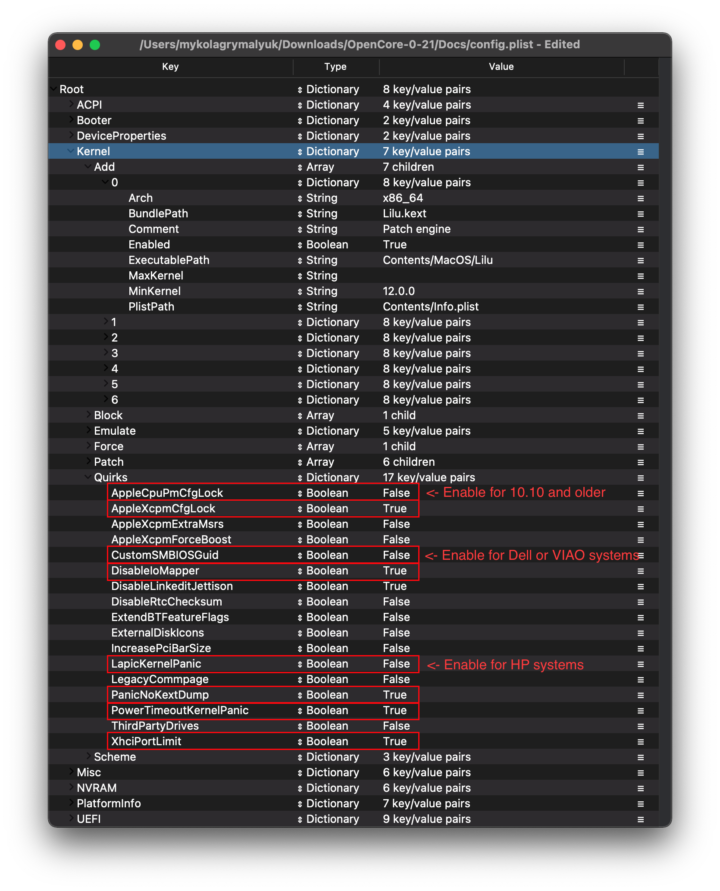
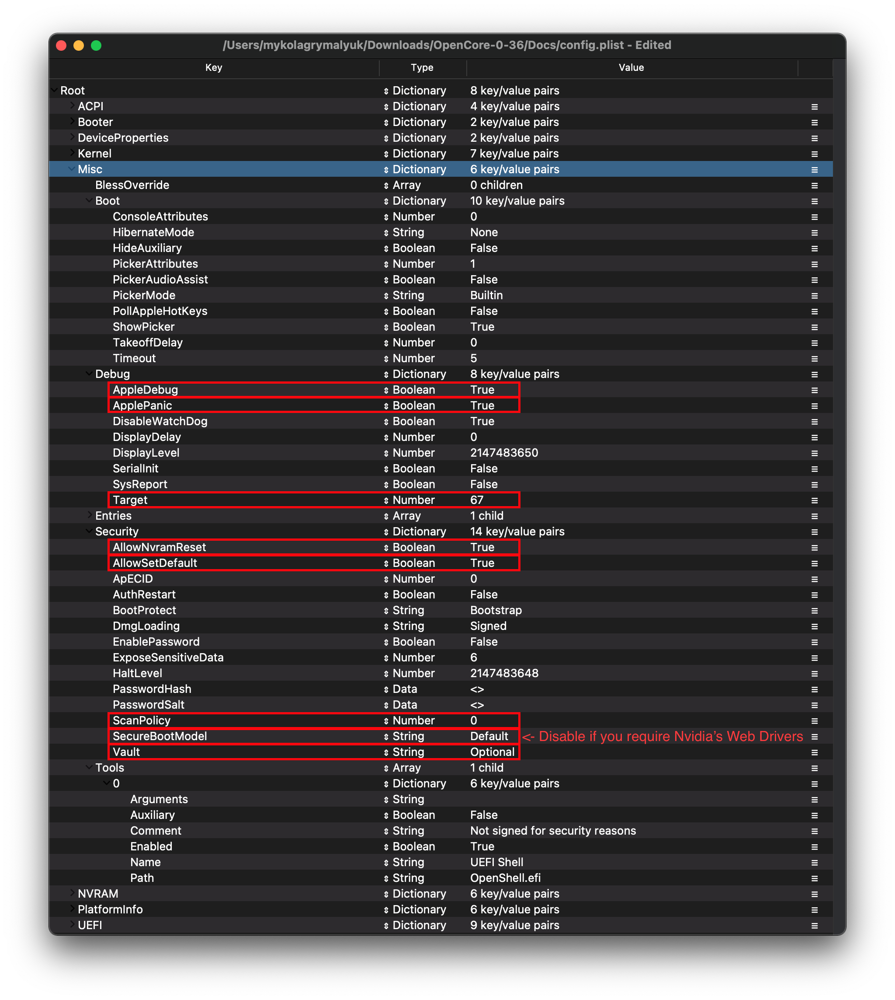

# Laptop Haswell

| Hỗ trợ | Phiên bản |
| :--- | :--- |
| Phiên bản macOS đầu tiên được hỗ trợ | OS X 10.8, Mountain Lion |

## Bắt đầu

Làm file config.plist trông có vẻ khó, nhưng thật ra không. Nó chỉ mất thời gian thôi nhưng bài hướng dẫn này sẽ giúp bạn cấu hình mọi thứ. Điều này cũng có nghĩa là nếu như bạn có vấn đề, hay xem lại file config để chắc chắn rằng bạn đã làm đúng. Những điều cần chú ý với OpenCore:

* **Mọi thuộc tính đều phải được đặt, OpenCore không có tùy chọn mặc định nên **đừng xóa phần nào trừ khi được nhắc đến**. Nếu bài hướng dẫn không nhắc đến tùy chọn đó, để yên nó như vậy
* **file sample.plist không thể được dùng nguyên trạng**, bạn phải chỉnh sửa nó cho máy tính của bạn
* **ĐỪNG DÙNG CONFIGURATORS**, chúng hiếm khi quan tâm đến các cấu hình của OpenCore và một số như của Mackie sẽ thêm các thuộc tính của Clover làm lỗi file plist

Với tất cả những điều trên, một lời nhắc nhở về những thứ mà chúng ta cần:

* [ProperTree](https://github.com/corpnewt/ProperTree)
  * Phần mềm edit file plist
* [GenSMBIOS](https://github.com/corpnewt/GenSMBIOS)
  * Dùng để tạo dữ liệu SMBIOS
* [Sample/config.plist](https://github.com/acidanthera/OpenCorePkg/releases)
  * Xem phần trước để biết cách lấy: [config.plist Setup](../config.plist/README.md)

**Đọc phần này nhiều hơn một lần trước khi thiết lập OpenCore và chắc chắn rằng bạn đã làm đúng. Nên nhớ rằng các hình ảnh không phải lúc nào cũng được cập nhật nên xin hay đọc phần chữ ở bên dưới, nếu không được nhắc đến thì hãy để như mặc định**

## ACPI


### Add

::: tip Thông tin

Đây là nơi mà bạn sẽ thêm các SSDT cho máy bạn, chúng rất quan trọng để **có thể boot được vào macOS** và có nhiều chức năng như để [map USB](https://viopencore.github.io/OpenCore-Post-Install/usb/), [tắt GPU rời](../extras/spoof.md), ... Và trong trường hợp của chúng ta, **cần phải có SSDT mới có thể boot được**. Hướng dẫn cách tạo SSDT ở đây: [**Bắt đầu với ACPI**](https://viopencore.github.io/Getting-Started-With-ACPI/)

Chúng ta cần một vài SSDT để mang lại các chức năng mà Clover có sẵn:

| SSDT_Cần_thiết | Mô tả |
| :--- | :--- |
| **[SSDT-PLUG](https://viopencore.github.io/Getting-Started-With-ACPI/)** | Cho phép quản lí điện năng trên các dòng chip Haswell hoặc mới hơn, xem [Hướng dẫn bắt đầu với ACPI](https://viopencore.github.io/Getting-Started-With-ACPI/) để biết thêm chi tiết. |
| **[SSDT-EC](https://viopencore.github.io/Getting-Started-With-ACPI/)** | Sửa bộ điều khiển tích hợp, xem [Hướng dẫn bắt đầu với ACPI](https://viopencore.github.io/Getting-Started-With-ACPI/) để biết thêm chi tiết. |
| **[SSDT-GPIO](https://github.com/dortania/Getting-Started-With-ACPI/blob/master/extra-files/decompiled/SSDT-GPI0.dsl.zip)** | Tạo ra một điểm mà VoodooI2C có thể kết nối đến, ai đang gặp khó khăn trong việc setup VoodooI2C có thể thử [SSDT-XOSI](https://github.com/dortania/Getting-Started-With-ACPI/blob/master/extra-files/compiled/SSDT-XOSI.aml) instead. Các dòng Intel NUC không cần SSDT này |
| **[SSDT-PNLF](https://viopencore.github.io/Getting-Started-With-ACPI/)** | Sửa phần chỉnh độ sáng, xem [Hướng dẫn bắt đầu với ACPI](https://viopencore.github.io/Getting-Started-With-ACPI/) để biết thêm chi tiết. Các dòng Intel NUC không cần SSDT này |

Lưu ý là bạn **không nên** thêm file DSDT.aml vào đây, nó đã có sẵn trong firmware. Nếu đã thêm thì hay loại bỏ nó trong config.plist và trong thư mục EFI/OC/ACPI 

Những ai muốn đi sâu hơn vào việc dump DSDT, cách làm DSDT và compile chúng, xin hãy xem trang [**Bắt đầu với ACPI**](https://viopencore.github.io/Getting-Started-With-ACPI/). Các SSDT đã được compile sẽ có phần mở rộng **.aml**, được thêm vào thư muacj `EFI/OC/ACPI` và **bắt buộc** phải được thêm vào trong file config.plist ở `ACPI -> Add`

:::

### Delete

Phần này chặn một số bảng ACPI chạy, có thể bỏ qua

### Patch

::: tip Thông tin

Phần này cho phép chúng ta chỉnh sửa các phần của ACPI (DSDT, SSDT, ...) trực tiếp qua OpenCore. Chúng ta cần:

* Đổi tên OSI
  * Cần thiết khi dùng SSDT-XOSI vì ta điều hướng mọi OSI calls đến SSDT này, **không cần thiết nếu bạn dùng SSDT-GPIO**

| Comment | String | Chuyển _OSI thành XOSI |
| :--- | :--- | :--- |
| Enabled | Boolean | YES |
| Count | Number | 0 |
| Limit | Number | 0 |
| Find | Data | 5f4f5349 |
| Replace | Data | 584f5349 |

:::

### Quirks

Các cài đặt liên quan đến ACPI, để mọi thứ ở đây như mặc định vì chúng ta không dùng đến chúng

## Booter



Phần này dành cho những cài đặt liên quan đến patching boot.efi với OpenRuntime, sự thay thế cho AptioMemoryFix.efi

### MmioWhitelist

This section is allowing spaces to be pass-through to macOS that are generally ignored, useful when paired with `DevirtualiseMmio`

### Quirks

::: tip Thông tin
Cài đặt liên quan đến việc patch boot.efi và sửa đổi về firmware, chúng ta không cần đến nên để mặc định
:::
::: details Thông tin chi tiết

* **AvoidRuntimeDefrag**: YES
  * Sửa những dịch vụ của UEFI như thời gian, NVRAM, quản lí điện năng, vân vân 
* **EnableSafeModeSlide**: YES
  * Enables slide variables to be used in safe mode.
* **EnableWriteUnprotector**: YES
  * Cần để loại bỏ giới hạn ghi của CR0.
* **ProvideCustomSlide**: YES
  * Dùng để tính toán biến Slide. Nhưng sự cần thiết của cài đặt này phụ thuộc vào `OCABC: Only N/256 slide values are usable!` trong log debug. Nếu thông báo `OCABC: All slides are usable! You can disable ProvideCustomSlide!` có trong log thì hãy tắt `ProvideCustomSlide`.
* **SetupVirtualMap**: YES
  * Sửa các phần gọi của SetVirtualAddresses đến các địa chỉ ảo, cần thiết cho các board Gigabyte để tránh kernel panic
  
:::

## DeviceProperties


### Add

Đặt thuộc tính của thiết bị qua bảng:

::: tip PciRoot(0x0)/Pci(0x2,0x0)

Phần này được đặt qua bài [Framebuffer Patching Guide](https://github.com/acidanthera/WhateverGreen/blob/master/Manual/FAQ.IntelHD.en.md) của WhateverGreen và được dùng để đặt các thuộc tính quan trong cho iGPU.

Khi thiết đặt iGPU, bảng bên dưới sẽ giúp bạn tìm các giá trị đúng để đặt. Đây là lời giải thích cho một số giá trị:

* **AAPL,ig-platform-id**
  * Được dùng bởi macOS để xác định iGPU
* **Loại**
  * Xác định rằng giá trị đó thích hợp cho laptop (các máy có màn hình tích hợp) hay cho Intel NUC (các máy bàn)

Hãy làm theo các bước sau để thiết đặt các giá trị iGPU. Làm theo các lưu ý ở dưới bảng nếu có gì khác:

1. Trong lần đầu làm file config.plist, chỉ đặt giá trị AAPL,ig-platform-id - thường thế này là đủ
2. Nếu bạn boot và không có kết xuất đồ họa (7MB VRAM và dock có nền màu đục), bạn thường phải thứ giá trị AAPL,`ig-platform-id` khác, thêm các patch stolenmem và thậm chí phải thêm giá trị cho `device-id`

| AAPL,ig-platform-id | Loại | bình luận |
| ------------------- | ---- | ------- |
| **0500260A** | Laptop | Thường được dùng với HD5000, HD5100 và HD5200 |
| **0600260A** | Laptop | Thường được dùng với HD4200, HD4400 and HD4600, bạn **phải** thêm `device-id`(thông tin bên dưới) |
| **0300220D** | NUC | Thường được dùng với tất cả máy NUC Haswell, HD4200/4400/4600 **phải** thêm `device-id`(thông tin bên dưới) |

#### Lưu ý

Ngoài AAPL,ig-platform-id, bạn có thể muốn thêm patch con trỏ chuột từ 6MB (00006000) đến 9MB vì nó có một vài lỗi:

| Key | Type | Value |
| :--- | :--- | :--- |
| framebuffer-patch-enable | Data | 01000000 |
| framebuffer-cursormem | Data | 00009000 |

**Lưu ý đặc biệt cho HD4200, HD4400 và HD4600**:

Bạn sẽ cần spoof device-id mới được hỗ trợ

| Key | Type | Value |
| :--- | :--- | :--- |
| device-id | Data | 12040000 |

:::

::: tip PciRoot(0x0)/Pci(0x1b,0x0)

`layout-id`

* Applies AppleALC audio injection, you'll need to do your own research on which codec your motherboard has and match it with AppleALC's layout. [AppleALC Supported Codecs](https://github.com/acidanthera/AppleALC/wiki/Supported-codecs).
* You can delete this property outright as it's unused for us at this time

For us, we'll be using the boot argument `alcid=xxx` instead to accomplish this. `alcid` will override all other layout-IDs present. More info on this is covered in the [Post-Install Page](https://viopencore.github.io/OpenCore-Post-Install/)

:::

### Delete

Loại bỏ các thuộc tính thiết bị khỏi bảng, chúng ta không cần đến phần này

## Kernel



### Add

Tại đây chúng ta xác định các kext để load, thứ tự load và kiến trúc mà mỗi kext hướng đến. Khuyến khích để mắc định nhưng đối với các CPU 32-bit xem bên dưới: 

::: details Thông tin chi tiết

Đáng chú ý nhất là:

* Thứ tự load: 
  * Nên nhớ rằng mọi plugin cần được load *sau* các thành phần phụ thuộc của nó
  * Điều này có nghĩa là các kext như Lilu **phải** được load trước VirtualSMC, AppleALC, WhateverGreen, vân vân

Người dùng ProperTree có thể dùng **Cmd/Ctrl + Shift + R** để tự động thêm các kext theo đúng thứ tự mà không cần phải nhập thủ công

* **Arch**
  * Kiến trúc CPU được hỗ trợ bởi kext
  * Các giá trị được hỗ trợ là `Any`(bất kì) , `i386` (32-bit) và `x86_64` (64bit)
* **BundlePath**
  * Tên của kext
  * Ví dụ: `Lilu.kext`
* **Enabled**
  * Kích hoạt hoặc vô hiệu hóa kext
* **ExecutablePath**
  * Đường dẫn đến đến file thực thi được giấu trong kext, bạn có thể xem đường dẫn này bằng cách nhấn chuột phải và chọn `Show Package Contents`. Thông thường chúng sẽ ở trong `Contents/MacOS/kext` nhưng một số kext được giấu trong thư mục `Plugin`. Lưu ý rằng các kext chỉ có file plist không cần điền phần này vào.
  * Ví dụ: `Contents/MacOS/Lilu`
* **MinKernel**
  * Kernel thấp nhất mà kext hỗ trợ, xem bảng bên dưới về các giá trị được dùng.
  * Ví dụ. `12.00.00` for OS X 10.8
* **MaxKernel**
  * Kernel thấp nhất mà kext hỗ trợ, xem bảng bên dưới về các giá trị được dùng.
  * Ví dụ. `11.99.99` for OS X 10.7
* **PlistPath**
  * Đường dẫn đến `info.plist` được giấu trong kext
  * Ví dụ: `Contents/Info.plist`
  
::: details Bảng các Kernel được hỗ trợ

| Phiên bản OSX | MinKernel | MaxKernel |
| :--- | :--- | :--- |
| 10.4 | 8.0.0 | 8.99.99 |
| 10.5 | 9.0.0 | 9.99.99 |
| 10.6 | 10.0.0 | 10.99.99 |
| 10.7 | 11.0.0 | 11.99.99 |
| 10.8 | 12.0.0 | 12.99.99 |
| 10.9 | 13.0.0 | 13.99.99 |
| 10.10 | 14.0.0 | 14.99.99 |
| 10.11 | 15.0.0 | 15.99.99 |
| 10.12 | 16.0.0 | 16.99.99 |
| 10.13 | 17.0.0 | 17.99.99 |
| 10.14 | 18.0.0 | 18.99.99 |
| 10.15 | 19.0.0 | 19.99.99 |
| 11 | 20.0.0 | 20.99.99 |

:::

### Emulate

Dùng để spoof các CPU Celeron và Pentium

* **CpuidMask**: Để trống
* **CpuidData**: Để trống

### Force

Dùng để load kext từ phân vùng hệ thống, chỉ liên quan đến các bản macOS cũ hơn mà có một vài kext không có sẵn trong cache (Ví dụ. IONetworkingFamily trong 10.6)

Phần này có thể bỏ qua

### Block

Chặn load một số kext, không cần quan tâm đến phần này

### Patch

Patch cả kernel và các kext

### Quirks

::: tip Thông tin

Các cài đặt liên quan đến kernel, chúng ta sẽ kích hoạt những thứ sau đây: 

| Quirk | Enabled | Comment |
| :--- | :--- | :--- |
| AppleCpuPmCfgLock | NO | Cần thiết nếu chạy 10.10 hoặc cũ hơn và không thể tắt `CFG-Lock` trong BIOS |
| AppleXcpmCfgLock | YES | Không cần thiết nếu CFG-Lock được tắt trong BIOS |
| DisableIOMapper | YES | Không cần thiết nếu VT-d được tắt trong BIOS |
| LapicKernelPanic | NO | Các máy HP cần cài đặt này |
| PanicNoKextDump | YES | |
| PowerTimeoutKernelPanic | YES | |
| XhciPortLimit | YES | |

:::

::: details Thông tin chi tiết

* **AppleCpuPmCfgLock**: NO
  * Only needed when CFG-Lock can't be disabled in BIOS
  * Only applicable for Ivy Bridge and older
    * Note: Broadwell and older require this when running 10.10 or older
* **AppleXcpmCfgLock**: YES
  * Only needed when CFG-Lock can't be disabled in BIOS
  * Only applicable for Haswell and newer
    * Note: Ivy Bridge-E is also included as it's XCPM capable
* **CustomSMBIOSGuid**: NO
  * Performs GUID patching for UpdateSMBIOSMode set to `Custom`. Usually relevant for Dell laptops
  * Enabling this quirk with UpdateSMBIOSMode Custom mode can also disable SMBIOS injection into "non-Apple" OSes however we do not endorse this method as it breaks Bootcamp compatibility. Use at your own risk
* **DisableIoMapper**: YES
  * Needed to get around VT-D if either unable to disable in BIOS or needed for other operating systems, much better alternative to `dart=0` as SIP can stay on in Catalina
* **DisableLinkeditJettison**: YES
  * Allows Lilu and others to have more reliable performance without `keepsyms=1`
* **DisableRtcChecksum**: NO
  * Prevents AppleRTC from writing to primary checksum (0x58-0x59), required for users who either receive BIOS reset or are sent into Safe mode after reboot/shutdown
* **ExtendBTFeatureFlags** NO
  * Helpful for those having continuity issues with non-Apple/non-Fenvi cards
* **LapicKernelPanic**: NO
  * Disables kernel panic on AP core lapic interrupt, generally needed for HP systems. Clover equivalent is `Kernel LAPIC`
* **LegacyCommpage**: NO
  * Resolves SSSE3 requirement for 64 Bit CPUs in macOS, mainly relevant for 64-Bit Pentium 4 CPUs(ie. Prescott)
* **PanicNoKextDump**: YES
  * Allows for reading kernel panics logs when kernel panics occur
* **PowerTimeoutKernelPanic**: YES
  * Helps fix kernel panics relating to power changes with Apple drivers in macOS Catalina, most notably with digital audio.
* **SetApfsTrimTimeout**: `-1`
  * Sets trim timeout in microseconds for APFS filesystems on SSDs, only applicable for macOS 10.14 and newer with problematic SSDs.
* **XhciPortLimit**: YES
  * This is actually the 15 port limit patch, don't rely on it as it's not a guaranteed solution for fixing USB. Please create a [USB map](https://viopencore.github.io/OpenCore-Post-Install/usb/) when possible.

The reason being is that UsbInjectAll reimplements builtin macOS functionality without proper current tuning. It is much cleaner to just describe your ports in a single plist-only kext, which will not waste runtime memory and such

:::

### Scheme

Các cài đặt liên quan đến boot các bản macOS cũ (10.4-10.6), hầu hết có thể bỏ qua nhưng đối với nhứng người muốn boot các bản cũ xem bên dưới:

::: details Thông tin chi tiết

* **FuzzyMatch**: True
  * Used for ignoring checksums with kernelcache, instead opting for the latest cache available. Can help improve boot performance on many machines in 10.6
* **KernelArch**: x86_64
  * Set the kernel's arch type, you can choose between `Auto`, `i386` (32-bit), and `x86_64` (64-bit).
  * If you're booting older OSes which require a 32-bit kernel(ie. 10.4 and 10.5) we recommend to set this to `Auto` and let macOS decide based on your SMBIOS. See below table for supported values:
    * 10.4-10.5 — `x86_64`, `i386` or `i386-user32`
      * `i386-user32` refers 32-bit userspace, so 32-bit CPUs must use this(or CPUs missing SSSE3)
      * `x86_64` will still have a 32-bit kernelspace however will ensure 64-bit userspace in 10.4/5
    * 10.6 — `i386`, `i386-user32`, or `x86_64`
    * 10.7 — `i386` or `x86_64`
    * 10.8 or newer — `x86_64`

* **KernelCache**: Auto
  * Đặt kiểu kernel cache, hữu dụng trong việc gỡ lỗi nên nên đặt thành `Auto`

:::

## Misc



### Boot

Các cài đặt cho màn hình boot (để mọi thứ theo mặc định)

### Debug

::: tip Thông tin

Giúp ích trong việc gỡ lỗi các sự cố boot (Chúng ta sẽ thay đổi mọi thứ *trừ* `DisplayDelay`):

| Quirk | Enabled |
| :--- | :--- |
| AppleDebug | YES |
| ApplePanic | YES |
| DisableWatchDog | YES |
| Target | 67 |

:::

::: details Thông tin chi tiết

* **AppleDebug**: YES
  * Kích hoạt log boot.efi, giúp ích cho việc gỡ lỗi, chỉ hỗ trợ từ bản 10.15.4
* **ApplePanic**: YES
  * Log lại kernel panic vào ổ
* **DisableWatchDog**: YES
  * Tắt watchdog UEFI, giúp cho việc gỡ lỗi
* **DisplayLevel**: `2147483650`
  * Hiện thêm nhiều thông tin gỡ lỗi, chỉ có trong bản DEBUG của OpenCore
* **SerialInit**: NO
  * Cần thiết cho việc gỡ lỗi qua serial
* **SysReport**: NO
  * Giúp ích trong việc gỡ lỗi như dump các bảng ACPI, vân vân
  * Chỉ bản DEBUG của OpenCore mới có tùy chọn này
* **Target**: `67`
  * Hiện thêm nhiều thông tin gỡ lỗi, chỉ có trong bản DEBUG của OpenCore

Các giá trị này được tính toán dựa trên [Gỡ lỗi OpenCore](../troubleshooting/debug.md)

:::

### Security

::: tip Thông tin

**Không được bỏ qua phần này**, chúng ta sẽ thay đổi những điều sau:

| Quirk | Enabled | Comment |
| :--- | :--- | :--- |
| AllowNvramReset | YES | |
| AllowSetDefault | YES | |
| BlacklistAppleUpdate | YES | |
| ScanPolicy | 0 | |
| SecureBootModel | Default |  Đây là một từ và có phân biệt chữ hoa/thường, đặt thành `Disabled` nếu bạn không muốn Secure Boot (ví dụ như bạn cần Nvidia Web Driver) |
| Vault | Optional | Đây là một tự, bạn không được bỏ quên tùy chọn này, lưu ý là nó có phân biệt chữ hoa/thường. |

:::

::: details Thông tin chi tiết

* **AllowNvramReset**: YES
  * Allows for NVRAM reset both in the boot picker and when pressing `Cmd+Opt+P+R`
* **AllowSetDefault**: YES
  * Allow `CTRL+Enter` and `CTRL+Index` to set default boot device in the picker
* **ApECID**: 0
  * Used for netting personalized secure-boot identifiers, currently this quirk is unreliable due to a bug in the macOS installer so we highly encourage you to leave this as default.
* **AuthRestart**: NO
  * Enables Authenticated restart for FileVault 2 so password is not required on reboot. Can be considered a security risk so optional
* **BlacklistAppleUpdate**: YES
  * Used for blocking firmware updates, used as extra level of protection as macOS Big Sur no longer uses `run-efi-updater` variable

* **DmgLoading**: Signed
  * Ensures only signed DMGs load
* **ExposeSensitiveData**: `6`
  * Shows more debug information, requires debug version of OpenCore
* **Vault**: `Optional`
  * We won't be dealing vaulting so we can ignore, **you won't boot with this set to Secure**
  * This is a word, it is not optional to omit this setting. You will regret it if you don't set it to `Optional`, note that it is case-sensitive
* **ScanPolicy**: `0`
  * `0` allows you to see all drives available, please refer to [Security](https://viopencore.github.io/OpenCore-Post-Install/universal/security.html) section for further details. **Will not boot USB devices with this set to default**
* **SecureBootModel**: Default
  * Enables Apple's secure boot functionality in macOS, please refer to [Security](https://viopencore.github.io/OpenCore-Post-Install/universal/security.html) section for further details.
  * Note: Users may find upgrading OpenCore on an already installed system can result in early boot failures. To resolve this, see here: [Stuck on OCB: LoadImage failed - Security Violation](/troubleshooting/extended/kernel-issues.md#stuck-on-ocb-loadimage-failed-security-violation)

:::

### Tools

Dùng để chạy các phân mềm gỡ lỗi của OpenCore như UEFI shell, chức năng snapshot của ProperTree sẽ tự động thêm chúng

### Entries

Dùng để xác định các đường dẫn boot mà OpenCore không thể tự tìm

Sẽ không được hướng dẫn ở đây, xem phần 8.6 của [Configuration.pdf](https://github.com/acidanthera/OpenCorePkg/blob/master/Docs/Configuration.pdf) để biết thêm chi tiết

## NVRAM


### Add

::: tip 4D1EDE05-38C7-4A6A-9CC6-4BCCA8B38C14

Dùng cho cài đặt scale UI của OpenCore, mặc định thường là đủ. Xem phần thông tin chi tiết để biết thêm.

:::

::: details Thông tin chi tiết

Booter Path, mainly used for UI Scaling

* **UIScale**:
  * `01`: Độ phân giải mặc định
  * `02`: HiDPI (Cần để FileVault hoạt động đúng trên các màn hình nhỏ)

* **DefaultBackgroundColor**: Màu nền được dùng bởi boot.efi
  * `00000000`: Đen Syrah
  * `BFBFBF00`: Xám nhạt

:::

::: tip 4D1FDA02-38C7-4A6A-9CC6-4BCCA8B30102

NVRAM GUID của OpenCore, chủ yếu dành cho người dùng RTCMemoryFixup

:::

::: details Thông tin chi tiết

* **rtc-blacklist**: <>
  * Được dùng song song với RTCMemoryFixup, thông tin chi tiết có trong: [Fixing RTC write issues](https://viopencore.github.io/OpenCore-Post-Install/misc/rtc.html#finding-our-bad-rtc-region)
  * Hầu hết người dùng có thể bỏ qua phần này

:::

::: tip 7C436110-AB2A-4BBB-A880-FE41995C9F82

System Integrity Protection bitmask

* **Các boot-args dùng chung**:

| boot-args | Description |
| :--- | :--- |
| **-v** | Kích hoạt verbose mode (cho chúng ta thấy tiến trình boot chi tiết thay vì logo Apple và thanh tiến trình), là thứ mà Hackintosher nào cũng cần, bởi vì nó giúp ta nhìn thấy chi tiết quá trình boot và giúp bạn xác định lỗi. |
| **debug=0x100** | Vô hiệu hóa watchdog của macOS, ngăn reboot khi có kernel panic, *mong là nó có thể* giúp bạn thấy một vài thông tin giúp ích để bạn vượt qua lỗi. |
| **keepsyms=1** | Đây là cài đặt đi đôi với debug=0x100 để buộc macOS in các ký hiểu trong kernel panic, giúp ích trong việc thấy các thông tin về nguyên nhân panic. |
| **alcid=1** | Dùng để set layout-id cho AppleALC, xem [supported codecs](https://github.com/acidanthera/applealc/wiki/supported-codecs) để biết được layout cần dùng cho build của bạn. Thông tin chi tiết có trong [Post-Install Page](https://viopencore.github.io/OpenCore-Post-Install/) |

* **Các boot-args dành riêng cho từng GPU**:

| boot-args | Description |
| :--- | :--- |
| **-wegnoegpu** | Vô hiệu hóa mọi GPU trừ iGPU của Intel |

* **csr-active-config**: `00000000`
  * Cài đặt cho 'System Integrity Protection' (SIP). Khuyến khích thay đổi cài đặt này qua `csrutil` tại recovery.
  * mặc định có giá trị `00000000` tức là bật SIP. Bạn có thể chọn các giá trị khác nhưng khuyến khích để nguyên vì các lí do bảo mật. Thông tin thêm có thể được tìm thấy tại: [Tắt SIP](../troubleshooting/extended/post-issues.md#disabling-sip)

* **run-efi-updater**: `No`
  * Dùng để chặn các bản cập nhất firmware của Apple làm hỏng thứ tự boot vì chúng dành cho các máy Mac thật.

* **prev-lang:kbd**: <>
  * Cần thiết đối với các bàn phím không phải latin với định dạng `lang-COUNTRY:keyboard`, khuyến khích để trống nhưng bạn vẫn có thể đổi(**Mặc định là tiếng Nga**):
  * Mĩ: `en-US:0`(`656e2d55533a30` trong HEX)
  * Danh sách đầy đủ có trong [AppleKeyboardLayouts.txt](https://github.com/acidanthera/OpenCorePkg/blob/master/Utilities/AppleKeyboardLayouts/AppleKeyboardLayouts.txt)
  * Gợi ý: `prev-lang:kbd` có thể được đổi thành dạng String để bạn điền `en-US:0` trực tiếp thay vì chuyển sang HEX 

| Key | Type | Value |
| :--- | :--- | :--- |
| prev-lang:kbd | String | en-US:0 |

:::

### Delete

Cưỡng bức ghi đè các biến NVRAM, lưu ý rằng `Add` **sẽ không ghi đè** các giá trị đã có sắn trong NVRAM nên các giá trị như `boot-args` nên được để nguyên.

* **LegacyEnable**: NO
  * Cho phép NVRAM được lưu trong nvram.plist, cần thiết cho các máy không có NVRAM

* **LegacyOverwrite**: NO
  * Cho phép ghi đè các biên trong firmware từ nvram.plist, chỉ cần thiết cho các máy không có NVRAM

* **LegacySchema**
  * Dùng để chỉ định các biến NVRAM, dùng với LegacyEnable được đặt thành YES

* **WriteFlash**: YES
  * Cho phép ghi vào bộ nhớ flash cho tất cả các biến được thêm.

## PlatformInfo


::: tip Thông tin

Để lấy thông tin SMBIOS, chúng ta sẽ dùng [GenSMBIOS](https://github.com/corpnewt/GenSMBIOS) của CorpNewt.

Trong ví dụ dành cho máy Haswell, chúng ta chọn SMBIOS của MacBookPro11,1. Điển hình như:

| SMBIOS | CPU Type | GPU Type | Display Size |
| :--- | :--- | :--- | :--- |
| MacBookAir6,1 | Dual Core 15w | iGPU: HD 5000 | 11" |
| MacBookAir6,2 | Dual Core 15w | iGPU: HD 5000 | 13" |
| MacBookPro11,1 | Dual Core 28w | iGPU: Iris 5100 | 13" |
| MacBookPro11,2 | Quad Core 45w | iGPU: Iris Pro 5200 | 15" |
| MacBookPro11,3 | Quad Core 45w | iGPU: Iris Pro 5200 + dGPU: GT750M | 15" |
| MacBookPro11,4 | Quad Core 45w | iGPU: Iris Pro 5200 | 15" |
| MacBookPro11,5 | Quad Core 45w | iGPU: Iris Pro 5200 + dGPU: R9 M370X | 15" |
| Macmini7,1 | NUC Systems | HD 5000/Iris 5100 | N/A |

Chạy GenSMBIOS, chọn 1 để tải MacSerial và chọn 3 để tạo SMBIOS. Nó sẽ hiện như sau:

```sh
  #######################################################
 #               MacBookPro11,1 SMBIOS Info            #
#######################################################

Type:         MacBookPro11,1
Serial:       C02M9SYJFY10
Board Serial: C02408101J9G2Y7A8
SmUUID:       7B227BEC-660D-405F-8E60-411B3E4EF055
```

Phần `Type` được copy vào Generic -> SystemProductName.

Phần `Serial` được copy vào Generic -> SystemSerialNumber.

Phần `Board Serial` được copy vào Generic -> MLB.

Phần `SmUUID` được copy vào -> SystemUUID.

Chúng ta đặt phần Generic -> ROM thành một ROM của Apple (được lấy từ một máy Mac thật), địa chỉ MAC của NIC, hoặc một địa chỉ MAC bất kì (chỉ cần 6 byte bất kì), trong bài này chúng tôi dùng 112233000000. Sau khi cài đặt làm theo [Fixing iServices](https://viopencore.github.io/OpenCore-Post-Install/universal/iservices.html) để tìm địa chỉ MAC thật của bạn

**Nên nhớ là bạn cân một số serial không hợp lệ hoặc một số serial hợp lệ nhưng không được sử dụng, bạn muốn có thông báo kiểu: "Invalid Serial" hoặc "Purchace Date not Validated"**

[Trang web Apple Check Coverage](https://checkcoverage.apple.com)

**Automatic**: YES

* Tạo ra PlatformInfo từ phần Generic thay vì từ DataHub, NVRAM, và phần SMBIOS

:::

### Generic

::: details Thông tin chi tiết

* **AdviseWindows**: NO
  * Used for when the EFI partition isn't first on the Windows drive

* **MaxBIOSVersion**: NO
  * Sets BIOS version to Max to avoid firmware updates in Big Sur+, mainly applicable for genuine Macs.

* **ProcessorType**: `0`
  * Set to `0` for automatic type detection, however this value can be overridden if desired. See [AppleSmBios.h](https://github.com/acidanthera/OpenCorePkg/blob/master/Include/Apple/IndustryStandard/AppleSmBios.h) for possible values

* **SpoofVendor**: YES
  * Swaps vendor field for Acidanthera, generally not safe to use Apple as a vendor in most case

* **SystemMemoryStatus**: Auto
  * Đặt phần RAM có được hàn chết hay không trong thông tin SMBIOS, hoàn toàn là để cho đẹp nên chúng ta đặt thành `Auto`

* **UpdateDataHub**: YES
  * Update Data Hub fields

* **UpdateNVRAM**: YES
  * Update NVRAM fields

* **UpdateSMBIOS**: YES
  * Updates SMBIOS fields

* **UpdateSMBIOSMode**: Create
  * Replace the tables with newly allocated EfiReservedMemoryType, use `Custom` on Dell laptops requiring `CustomSMBIOSGuid` quirk
  * Setting to `Custom` with `CustomSMBIOSGuid` quirk enabled can also disable SMBIOS injection into "non-Apple" OSes however we do not endorse this method as it breaks Bootcamp compatibility. Use at your own risk

:::

## UEFI


**ConnectDrivers**: YES

* Ép load các driver .efi, thay đổi thành NO sẽ tự động load các driver UEFI. Điểu này có thế giảm thời gian boot một chút nhưng không phải tất cả driver sẽ tự động load (Ví dụ như một số hệ thông tệp sẽ không truy cập được).

### Drivers

Thêm các driver .efi vào đây

Chỉ có 2 driver ở đây:

* HfsPlus.efi
* OpenRuntime.efi

### APFS

Các cài đặt liên quan đến driver APFS, để mọi thứ ở đây như mặc định.

### Audio

Liên quan đến các cài đặt của AudioDxe, để mọi thứ ở đây như mặc định vì chúng ta không cần đến chúng.

* Nếu muốn dùng AudioDxe và phần Audio, xem trang Post Install (Sau khi cài): [Thêm GUI và âm boot](https://viopencore.github.io/OpenCore-Post-Install/)

### Input

Liên quan đến passthrough bàn phím dành cho FileVault và Hotkey, để mọi thứ ở đây như mặc định vì chúng ta không cần đến chúng. Thông tin chi tiết có trong: [Bảo mật và FileVault](https://viopencore.github.io/OpenCore-Post-Install/)

### Output

Để mọi thứ ở đây như mặc định

### ProtocolOverrides

Chủ yếu dành cho máy ảo (VM), máy Mac cũ và người dùng FileVault. Thông tin chi tiết có trong: [Bảo mật và FileVault](https://viopencore.github.io/OpenCore-Post-Install/)

### Quirks

::: tip Thông tin
Liên quan đến các cài đặt dành cho môi trường UEFI, chúng ta thay đổi những thứ sau đây: 

| Quirk | Enabled | Comment |
| :--- | :--- | :--- |
| IgnoreInvalidFlexRatio | YES | |
| ReleaseUsbOwnership | YES | |
| UnblockFsConnect | NO | Thường các board HP mới cần |

:::

::: details Thông tin chi tiết

* **IgnoreInvalidFlexRatio**: YES
  * Fix for when MSR_FLEX_RATIO (0x194) can't be disabled in the BIOS, required for all pre-Skylake based systems
* **ReleaseUsbOwnership**: YES
  * Releases USB controller from firmware driver, needed for when your firmware doesn't support EHCI/XHCI Handoff. Most laptops have garbage firmwares so we'll need this as well
* **DisableSecurityPolicy**: NO
  * Disables platform security policy in firmware, recommended for buggy firmwares where disabling Secure Boot does not allow 3rd party firmware drivers to load.
  * If running a Microsoft Surface device, recommended to enable this option

* **RequestBootVarRouting**: YES
  * Redirects AptioMemoryFix from `EFI_GLOBAL_VARIABLE_GUID` to `OC_VENDOR_VARIABLE_GUID`. Needed for when firmware tries to delete boot entries and is recommended to be enabled on all systems for correct update installation, Startup Disk control panel functioning, etc.

* **UnblockFsConnect**: NO
  * Some firmware block partition handles by opening them in By Driver mode, which results in File System protocols being unable to install. Mainly relevant for HP systems when no drives are listed

:::

### Dọn dẹp

Dùng để miễn trừ một phần RAM nhất định dành cho các HĐH để sử dụng, chủ yếu dành cho các iGPU Sandy Bridge hay những máy với RAM hỏng. Phần này sẽ không được hướng dẫn trong bài này

## Cleaning up

Bây giờ bạn đã sẵn sàng để lưu và đặt file config.plist vào EFI/OC

Nếu bạn có vấn đề, vui lòng đọc phần [Gỡ lỗi](../troubleshooting/troubleshooting.md) trước tiên và nếu câu hỏi của bạn vẫn chưa được giải đáp, chúng tôi có nhiều chỗ bạn có thể hỏi (chỉ tiếng Anh): 

* [r/Hackintosh Subreddit](https://www.reddit.com/r/hackintosh/)
* [r/Hackintosh Discord](https://discord.gg/2QYd7ZT)

**Kiểm tra lại**:

* [**Sanity Checker**](https://opencore.slowgeek.com)

Công cụ này không phải của Dortania, mọi vấn đề với trang xin hãy gửi về đây: [Sanity Checker Repo](https://github.com/rlerdorf/OCSanity)

*Sanity Checker chưa được update từ bản OpenCore 0.6.6, nếu bạn ở bản mới hơn thì không nên dùng*

### Nhắc nhở về config

**Người dùng máy HP**:

* Kernel -> Quirks -> LapicKernelPanic -> True
  * Bạn sẽ panic ở phần LAPIC nếu bạn không đặt phần này
* UEFI -> Quirks -> UnblockFsConnect -> True

## Thiết đặt BIOS dành cho các máy Intel

* Note: Hầu hết các tùy chọn này có thể không có trong firmware của bạn, chúng tôi khuyến khích làm giống nhất có thể nhưng nếu tùy chọn đó không có trong BIOS của bạn thì cũng đừng quá lo lắng

### Vô hiệu hóa

* Fast Boot
* Secure Boot
* Serial/COM Port
* Parallel Port
* VT-d (có thể được bật nếu bạn đặt `DisableIoMapper` thành YES)
* CSM
* Thunderbolt(Trong lúc cài, Thunderbolt có thể gây ra vấn đề nều không được thiết đặt đúng)
* Intel SGX
* Intel Platform Trust
* CFG Lock (MSR 0xE2 write protection)(**Bắt buộc phải tắt, nếu bạn không thấy tùy chọn này thì bật `AppleXcpmCfgLock` tại Kernel -> Quirks. macOS sẽ không boot nếu CFG-Lock được bật**)
  * Nếu bạn chạy bản 10.10 hoặc cũ hơn, AppleCpuPmCfgLock cũng cần được bật

### Kích hoạt

* VT-x
* Above 4G decoding
* Hyper-Threading
* Execute Disable Bit
* EHCI/XHCI Hand-off
* OS type: Windows 8.1/10 UEFI Mode
* DVMT Pre-Allocated(iGPU Memory): 64MB
* SATA Mode: AHCI

# Tiếp theo, hãy đến phần [Cài đặt macOS](../installation/installation-process.md)
