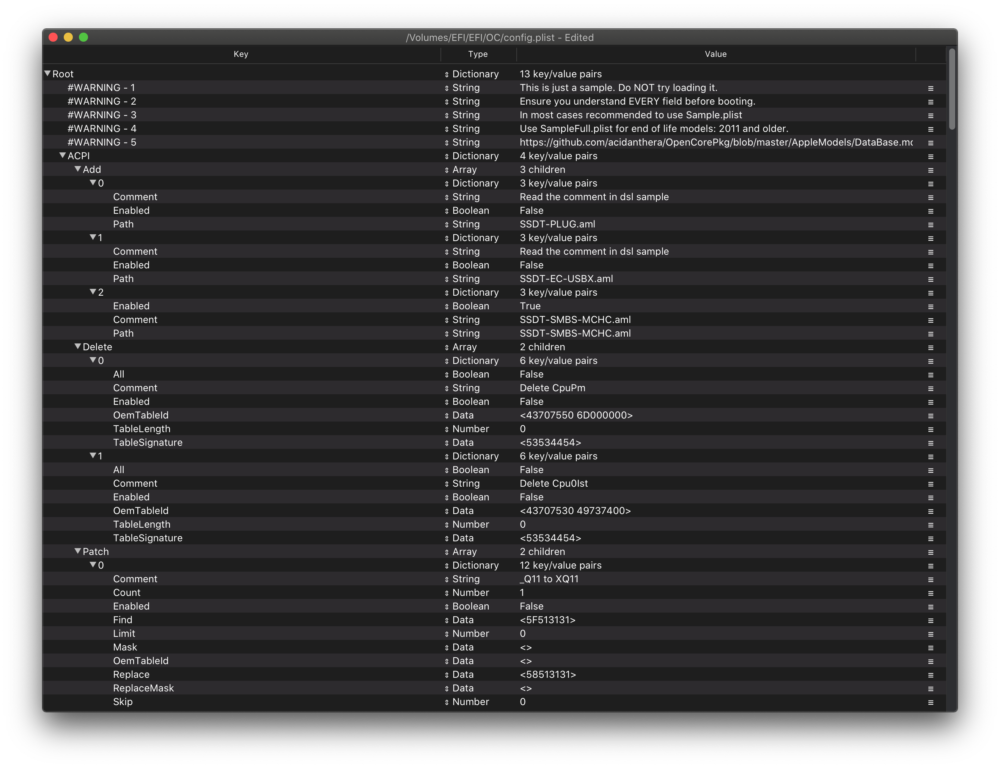

# Thiết lập config.plist

Sau khi chúng ta đã có tất cả Kext(.kext), SSDT(.aml) và Driver Firmware(.efi), chiếc USB của bạn sẽ bắt đầu trông giống như thế này:

* **Lưu ý**: USB của bạn **sẽ nhìn khác so với ảnh trên**, hệ thống của mỗi người sẽ có các yêu cầu khác nhau.

## Tạo ra config.plist của bạn

Đầu tiên chúng tôi muốn bạn kéo tệp sample.plist từ [OpenCorePkg](https://github.com/acidanthera/OpenCorePkg/releases), nó sẽ được lưu giữ ở thư mục `Docs`:

Tiếp theo hãy di chuyển nó vào trong phân vùng EFI của USB (sẽ được gọi là BOOT trên Windows) dưới `EFI/OC/`, và đổi tên nó thành config.plist:

## Thêm vào SSDT của bạn, Kext và Driver Firmware

Cho phần còn lại của guide này, bạn sẽ cần phải chỉnh sửa cái plist. Và trong guide này, chúng ta sẽ sử dụng ProperTree và GenSMBIOS để giúp tự động hoá những công việc tẻ nhạt này:

* [ProperTree](https://github.com/corpnewt/ProperTree)
  * Bộ chỉnh sửa plist đa năng
* [GenSMBIOS](https://github.com/corpnewt/GenSMBIOS)
  * Để tạo ra thông tin SMBIOS cùa chúng ta

Tiếp theo, mở tện ProperTree và chỉnh sửa config.plist của chúng ta:

* `ProperTree.command`
  * Dành cho macOS
  * Pro tip: Có tiện ích `buildapp.command` ở trong thư mục `Scripts` sẽ giúp bạn biến ProperTree trở thành một ứng dụng chuyên dụng trong macOS
* `ProperTree.bat`
  * Dành cho Windows

Một khi ProperTree đã khởi chạy, mở tệp config.plist của bạn bằng cách nhấn **Cmd/Ctrl + O** và lựa chọn tệp `config.plist` trên USB của bạn.

Sau khi tệp config được mở, nhấn **Cmd/Ctrl + Shift + R** và chỉ nó tại thư mục EFI/OC để thực hiện "Clean Snapshot":

* Nó sẽ gỡ bỏ hết tất cả các entries từ config.plist và sẽ thêm vào tất cả SSDT, Kext và Driver firmware vào trong config
* **Cmd/Ctrl + R** là một lựa chọn khác mà sẽ thêm tất cả các tệp của bạn vào nhưng sẽ để lại các entry đã bị disable nếu nó được đặt như thế trước đó, phù hợp khi bạn đang phải xử lí sự cố nhưng hiện tại chúng ta sẽ không cần đến nó

Một khi đã xong, bạn sẽ thấy SSDT, Kext và driver firmware xuất hiện trong config.plist:

* **Lưu ý:** Nếu bạn nhận được thông báo "Disable the following kexts with Duplicate CFBundleIdentifiers?", nhấn "Yes". Điều này để chắc chắn rằng bạn không có những kext giống nhau được inject, tại vì một số kext sẽ có những plugin giống nhau(VD. VoodooInput đều có ở trong thư mục plugin của VoodooPS2 và VoodooI2C)

Nếu bạn muốn dọn dẹp tệp một chút, bạn có thể bỏ entry `#WARNING`. Tuy chúng nó không gây ra vấn đề gì, nhưng đó là tuỳ ý bạn.

## Lựa chọn nền tảng của bạn

Bây giờ thì tới phần quan trọng nhất, lựa chọn đường dẫn để cấu h. Mỗi nền tảng sẽ có những quirk độc nhất mà bạn cần xem nên hiểu biết phần cứng của bạn là một điều vô cùng quan trọng. Xem ở phía dưới để theo :

### Intel Desktop

* Lưu ý: Dòng máy Intel NUC được xem như là phần cứng di động, trong trường này chúng tôi khuyến khích bạn theo [Intel Laptop](#intel-laptop)

| Tên mã | Series | Ra mắt |
| :--- | :--- | :--- |
| [Yonah, Conroe và Penryn](../config.plist/penryn.md) | E8XXX, Q9XXX, [etc 1](https://en.wikipedia.org/wiki/Yonah_(microprocessor)), [etc 2](https://en.wikipedia.org/wiki/Penryn_(microarchitecture)) | Thời 2006-2009 |
| [Lynnfield và Clarkdale](../config.plist/clarkdale.md) | 5XX-8XX | Thời 2010 |
| [Sandy Bridge](../config.plist/sandy-bridge.md) | 2XXX | Thời 2011 |
| [Ivy Bridge](../config.plist/ivy-bridge.md) | 3XXX | Thời 2012 |
| [Haswell](../config.plist/haswell.md) | 4XXX | Thời 2013-2014 |
| [Skylake](../config.plist/skylake.md) | 6XXX | Thời 2015-2016 |
| [Kaby Lake](../config.plist/kaby-lake.md) | 7XXX | Thời 2017 |
| [Coffee Lake](../config.plist/coffee-lake.md) | 8XXX-9XXX | Thời 2017-2019 |
| [Comet Lake](../config.plist/comet-lake.md) | 10XXX | Thời 2020 |

### Intel Laptop

| Tên mã | Series | Ra mắt |
| :--- | :--- | :--- |
| [Clarksfield và Arrandale](../config-laptop.plist/arrandale.md) | 3XX-9XX | Thời 2010 |
| [Sandy Bridge](../config-laptop.plist/sandy-bridge.md) | 2XXX | Thời 2011 |
| [Ivy Bridge](../config-laptop.plist/ivy-bridge.md) | 3XXX | Thời 2012 |
| [Haswell](../config-laptop.plist/haswell.md) | 4XXX | Thời 2013-2014 |
| [Broadwell](../config-laptop.plist/broadwell.md) | 5XXX | Thời 2014-2015 |
| [Skylake](../config-laptop.plist/skylake.md) | 6XXX | Thời 2015-2016 |
| [Kaby Lake and Amber Lake](../config-laptop.plist/kaby-lake.md) | 7XXX | Thời 2017 |
| [Coffee Lake and Whiskey Lake](../config-laptop.plist/coffee-lake.md) | 8XXX | Thời 2017-2018 |
| [Coffee Lake Plus and Comet Lake](../config-laptop.plist/coffee-lake-plus.md) | 9XXX-10XXX | Thời 2019-2020 |
| [Ice Lake](../config-laptop.plist/icelake.md) | 10XXX | Thời 2019-2020 |

### Intel HEDT

Phần này bao gồm những phần cứng chuyên dụng và server.

| Tên mã | Series | Ra mắt |
| :--- | :--- | :--- |
| [Nehalem  Westmere](../config-HEDT/nehalem.md) | 9XX, X3XXX, X5XXX, [etc 1](https://en.wikipedia.org/wiki/Nehalem_(microarchitecture)), [2](https://en.wikipedia.org/wiki/Westmere_(microarchitecture)) | Thời 2008-2010 |
| [Sandy/Ivy Bridge-E](../config-HEDT/ivy-bridge-e.md) | 3XXX, 4XXX | Thời 2011-2013 |
| [Haswell-E](../config-HEDT/haswell-e.md) | 5XXX | Thời 2014 |
| [Broadwell-E](../config-HEDT/broadwell-e.md) | 6XXX | Thời 2016 |
| [Skylake/Cascade Lake-X/W](../config-HEDT/skylake-x.md) | 7XXX, 9XXX, 10XXX | Thời 2017-2019 |

### AMD

| Tên mã | Series | Ra mắt |
| :--- | :--- | :--- |
| [Bulldozer/Jaguar](../AMD/fx.md) | [Rất ngớ ngẩn](https://en.wikipedia.org/wiki/List_of_AMD_processors#Bulldozer_architecture;_Bulldozer,_Piledriver,_Steamroller,_Excavator_(2011%E2%80%932017)) | [AMD cực kỳ tệ trong việc đặt tên khi đó](https://en.wikipedia.org/wiki/List_of_AMD_processors#Bulldozer_architecture;_Bulldozer,_Piledriver,_Steamroller,_Excavator_(2011%E2%80%932017)) |
| [Zen](../AMD/zen.md) | 1XXX, 2XXX, 3XXX, 5XXX | Thời 2017-2020 |

* Lưu ý: ~~Threadripper thế hệ thứ ba(39XX) không được hỗ trợ, tuy thế hệ thứ nhất và hai đều được hỗ trợ~~
  * Phiên bản BIOS và OpenCore mới nhất đã giải quyết được vấn đề này, tất cả thế hệ Threadripper đều được hỗ trợ
