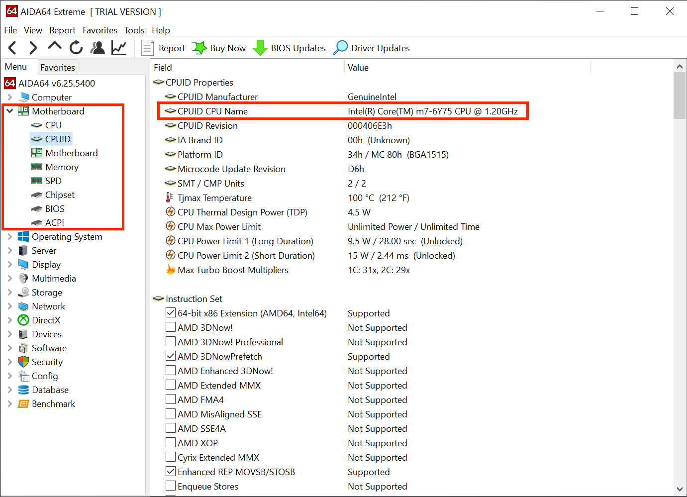
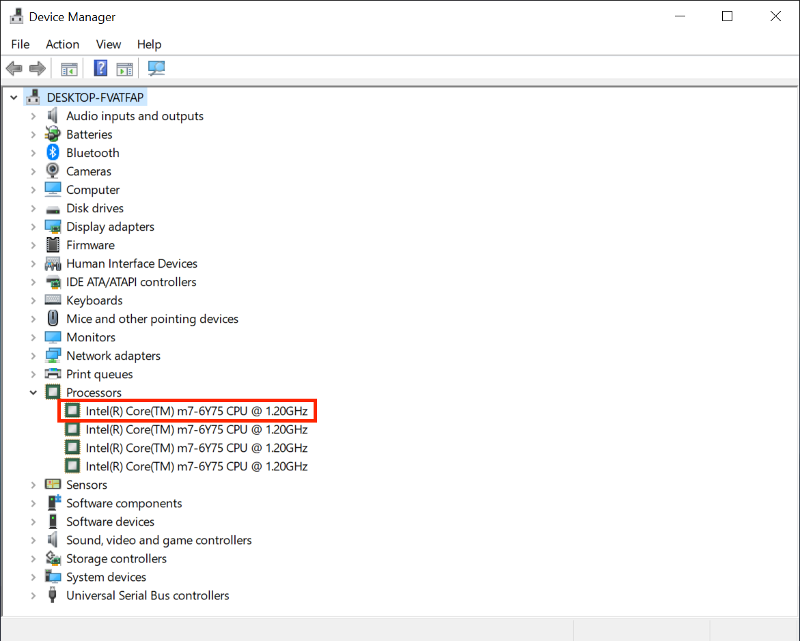
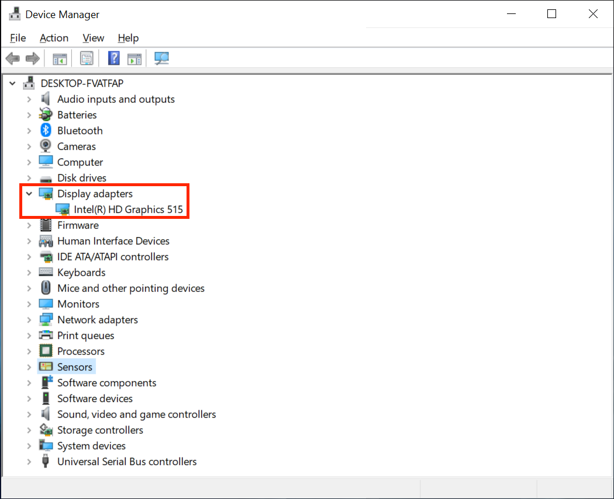
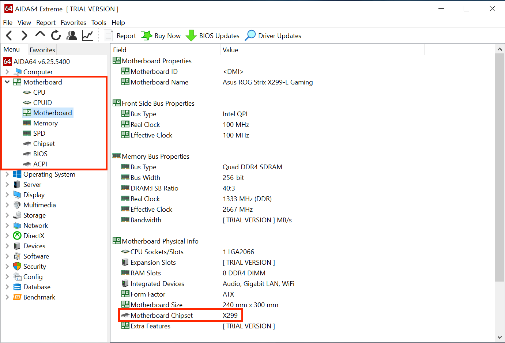
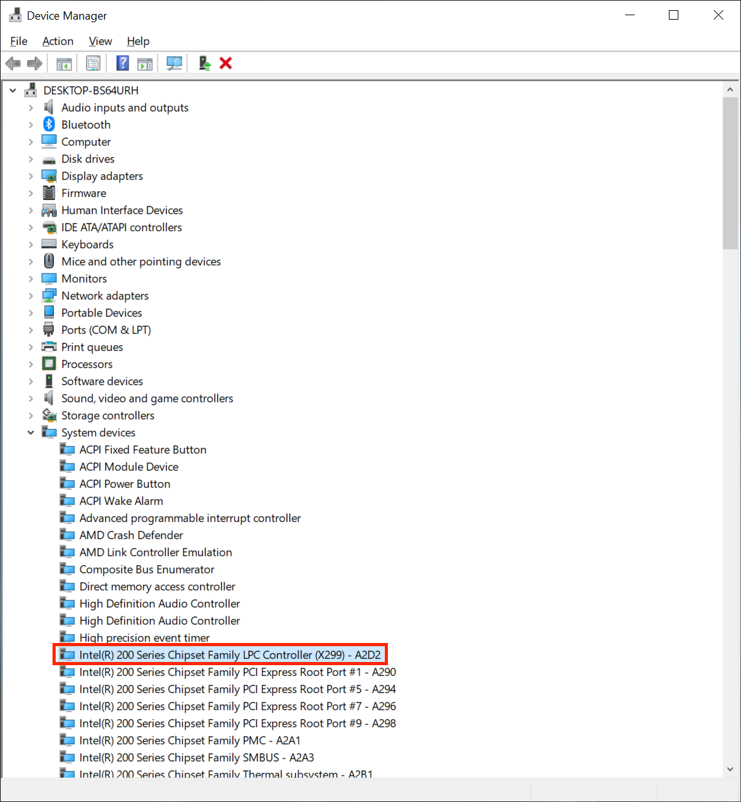
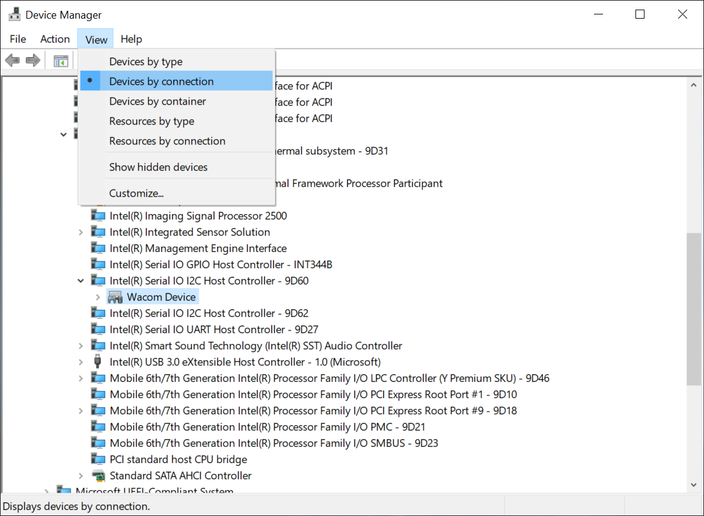
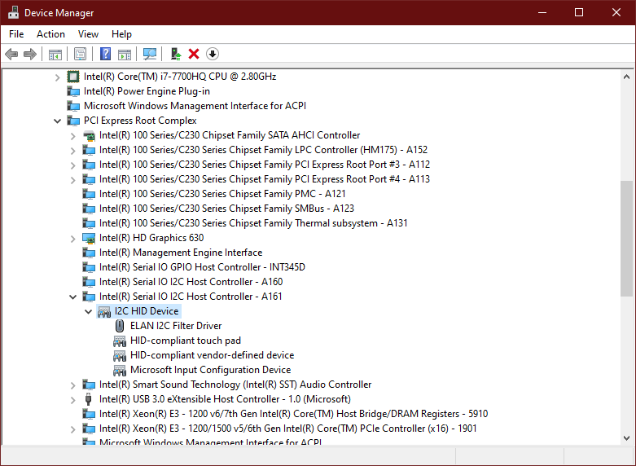
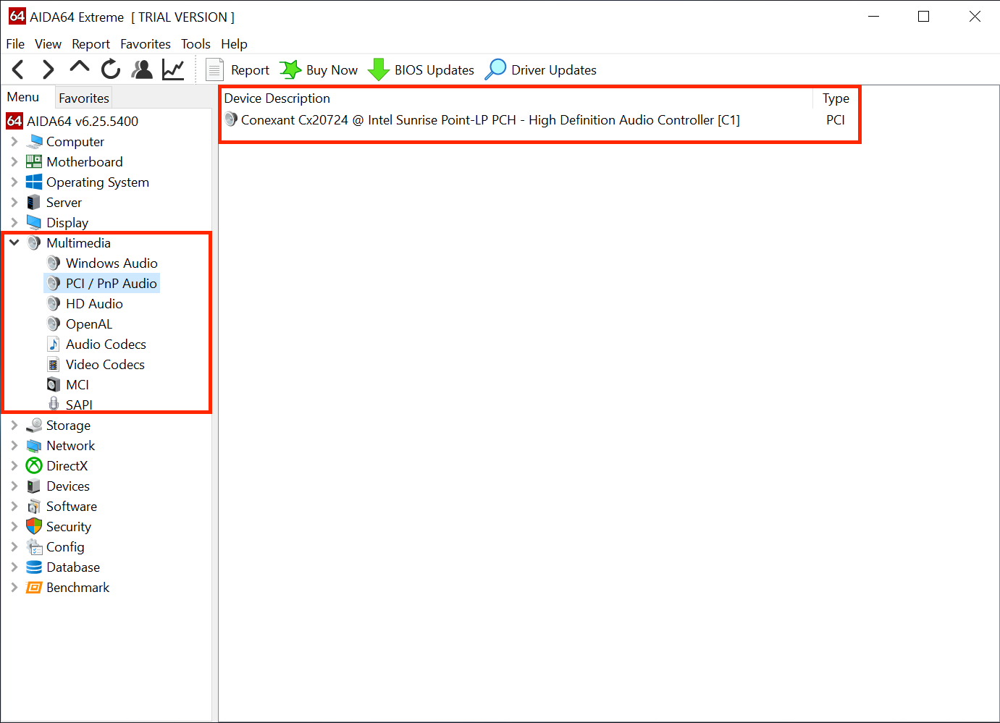
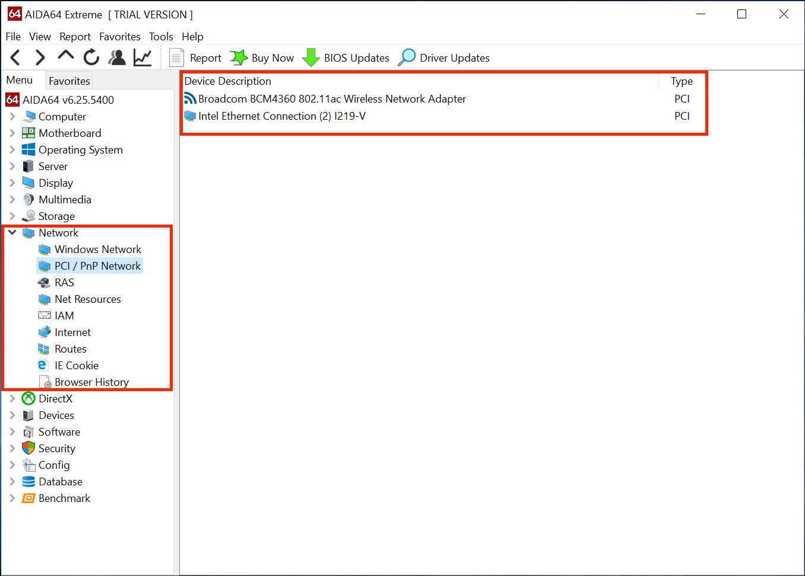

# Tìm hiểu phần cứng (cấu hình của bạn)

Mục này chỉ là một hướng dẫn nhỏ cho việc bạn đang sử dụng phần cứng như thế nào. Nếu bạn đã biết thì bạn hãy chuyển qua mục [Tạo USB](./installer-guide/).

Trước hết, chúng ta sẽ xem bạn đang sử dụng Windows hay Linux:
* [Nếu bạn đang sử dụng Microsoft Windows](#finding-hardware-using-windows)
* [Nếu bạn đang sử dụng Linux](#finding-hardware-using-linux)

## Nếu bạn đang sử dụng Windows

Chúng ta sẽ có 2 lựa chọn:

* Device Manager trên Windows (devmgmt.msc)
* [AIDA64](https://www.aida64.com/downloads)

Bởi vì AIDA64 dễ sử dụng hơn và tìm được chi tiết hơn cho nên khuyến cáo các bạn sử dụng. Tuy nhiên chúng tôi cũng sẽ chỉ cho bạn cả 2 cách.

### Loại CPU

| AIDA64 | Device Manager|
| :--- | :--- |
|  |  |

### Loại GPU

| AIDA64 | DeviceManager|
| :--- | :--- |
|  |  |

### Loại Chipset

| AIDA64 | DeviceManager|
| :--- | :--- |
|  |  |

* Note: Một số loại chip Intel kiểu SoC (System on Chip) sẽ có chipset và một số thứ khác đã tích hợp sẵn trong một nhân thay vì riêng một số bộ phận, cho nên việc xác định chipset sẽ khó hơn.

### Cổng kết nối bàn phím, trackpad, màn hình cảm ứng

| DeviceManager |
| :--- |
|  |

AIDA64 sẽ không cho bạn biết thông tin hữu ích liên quan tới những cái này, cho nên chúng tôi khuyến khích sử dụng DeviceManager

* Bạn có thể tìm thấy tại:
  * `Human Interface Devices`
  * `Keyboards`
  * `Mice and other Pointer Devices`

* Để xem một cách chính xác hơn, bạn trỏ vào thiết bị của bạn và chọn `View -> Device by Connection`. Nó sẽ cho bạn biết là bạn đang sử dụng kiểu kết nối nào (PS2, I2C, SMBus, USB,...)

Tùy vào thiết bị thì chúng ta sẽ có thể thấy nhiều thiết bị và kiểu kết nối. Những thứ bạn cần để ý tới:
  
::: details SMBus
  
Nó sẽ hiện lên thiết bị PCI như `Synaptics SMBus Driver` hay `ELAN SMBus Driver`

* Với các thiết bị của Synaptics thì nó sẽ hiện PS2 dưới mục `Synaptics PS2 device`/`Synaptics Pointing Device` và PCI dưới tên `Synaptics SMBus Driver`


Như bạn có thể thấy, chúng ta có 2 thiết bị Synaptics ở hình trái, nhưng nếu chúng ta tìm hiểu kĩ thì sẽ thấy thiết bị trên sử dụng PS2, còn ở dưới là SMBus. Bạn có thể sử dụng một trong hai kiểu kết nối, nhưng SMBus sẽ có khả năng sử dụng cử chỉ tốt hơn và chính xác hơn.

:::

::: details USB

| Theo loại | Theo kiểu kết nối |
| :--- | :--- |
|  | 

Nó sẽ hiện lên dưới dạng `PS2 Compliant Trackpad`, bên dưới mục USB chúng ta có thể xem dưới dạng `Theo kiểu kết nối`

:::

::: details I2C


Đa phần sẽ hiện là Microsoft HID device, nhưng chúng cũng có thể hiện kiểu trackpad khác. Chúng sẽ luôn hiện dưới thiết bị I2C.

:::
  
### Audio Codec (Codec âm thanh)

| AIDA64 | DeviceManager|
| :--- | :--- |
|  |  |

Tùy vào các nhà sản xuất đặt tên, thông tin chính xác nhất bạn có thể tìm ở Device Manager là tìm ở dưới PCI ID (VD: pci 14F1,50F4), bạn sẽ phải tra Google để biết loại audio codec. Tuy nhiên, bạn cũng có thể tìm ở AIDA64, sẽ dễ hơn rất nhiều.

### Network Controller models (Thiết bị kết nối mạng)

| AIDA64 | Device Manager|
| :--- | :--- |
|  |  |

Cũng như audio codec, bạn cũng sẽ tìm thấy thông tin mạng ở Device Manager qua PCI ID (VD. `PCI\VEN_14E4&DEV_43A0` sẽ cho chúng ta biết vendor ID là `14E4` và device ID là `43A0`). Bạn sẽ phải tra Google để biết. Tuy nhiên, bạn cũng có thể tìm ở AIDA64, sẽ dễ hơn rất nhiều.

### Thiết bị lưu trữ (Ổ cứng, USB, ổ đĩa,...)

| AIDA64 | Device Manager|
| :--- | :--- |
|  |  |

Bởi vì nhà sản xuất không cho chúng ta nhiều thông tin về mục này cho nên bạn sẽ phải tra Google để xem.

## Nếu bạn đang sử dụng Linux

Chúng ta sẽ sử dụng một vài lệnh như bên dưới:

* `cat`
* `pciutils`
* `dmidecode`

Thường thì bạn sẽ có những thứ này được cài đặt sẵn trong hệ điều hành, nhưng nếu không có thì bạn có thể cài đặt chúng.

### Loại CPU

```sh
cat /proc/cpuinfo | grep -i "model name"
```

### Loại GPU

```sh
lspci | grep -i --color "vga\|3d\|2d"
```

### Loại Chipset

```sh
dmidecode -t baseboard
```

### Cổng kết nối bàn phím, trackpad, màn hình cảm ứng

```sh
dmesg | grep -i input
```

### Audio Codec (Codec âm thanh)

```sh
aplay -l
```

### Network Controller models (Thiết bị kết nối mạng)

Thông tin cơ bản:

```sh
lspci | grep -i network
```

Thông tin chi tiết:

```sh
lshw -class network
```

### Thiết bị lưu trữ (Ổ cứng, USB, ổ đĩa,...)

```sh
lshw -class disk -class storage
```
