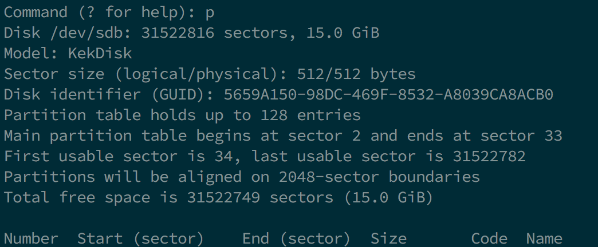
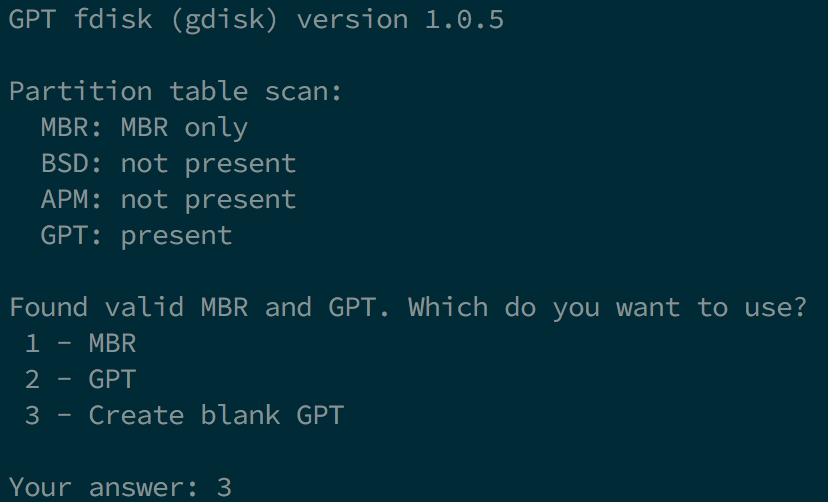
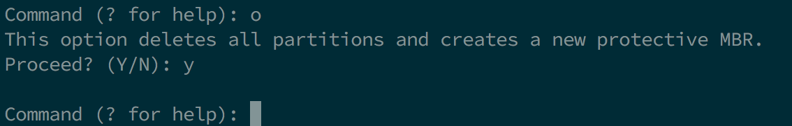
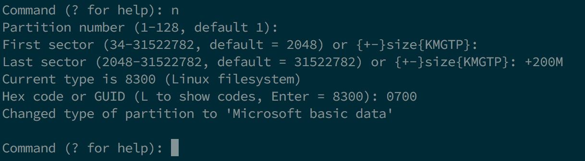
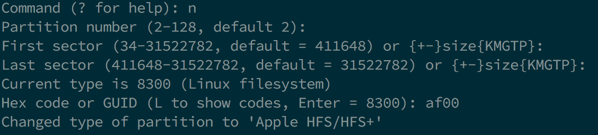
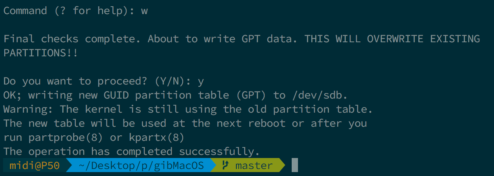

# Tạo bộ cài trong Linux

Trong khi bạn không cần phải có macOS mới có thể sử dụng OpenCore, một số người lại thích có fresh slate và update boot manager của họ.

Để bắt đầu bạn cần những thứ sau:

* Một USB 4GB
* [macrecovery.py](https://github.com/acidanthera/OpenCorePkg/releases)
  
## Tải macOS

Để bắt đầu, đầu tiên cd vào [thư mục chứa macrecovery](https://github.com/acidanthera/OpenCorePkg/releases) và chạy các lệnh sau đây:


```sh
# Điều chỉnh lệnh bên dưới cho phù hợp
cd ~/Downloads/OpenCore-0/Utilities/macrecovery/
```

Tiếp theo, chạy một trong những lệnh sau đây tùy vào bản macOS mà bạn muốn cài:

```sh
# Lion(10.7):
python ./macrecovery.py -b Mac-2E6FAB96566FE58C -m 00000000000F25Y00 download
python ./macrecovery.py -b Mac-C3EC7CD22292981F -m 00000000000F0HM00 download

# Mountain Lion(10.8):
python ./macrecovery.py -b Mac-7DF2A3B5E5D671ED -m 00000000000F65100 download

# Mavericks(10.9):
python ./macrecovery.py -b Mac-F60DEB81FF30ACF6 -m 00000000000FNN100 download

# Yosemite(10.10):
python ./macrecovery.py -b Mac-E43C1C25D4880AD6 -m 00000000000GDVW00 download

# El Capitan(10.11):
python ./macrecovery.py -b Mac-FFE5EF870D7BA81A -m 00000000000GQRX00 download

# Sierra(10.12):
python ./macrecovery.py -b Mac-77F17D7DA9285301 -m 00000000000J0DX00 download

# High Sierra(10.13)
python ./macrecovery.py -b Mac-7BA5B2D9E42DDD94 -m 00000000000J80300 download
python ./macrecovery.py -b Mac-BE088AF8C5EB4FA2 -m 00000000000J80300 download

# Mojave(10.14)
python ./macrecovery.py -b Mac-7BA5B2DFE22DDD8C -m 00000000000KXPG00 download

# Catalina(10.15)
python ./macrecovery.py -b Mac-00BE6ED71E35EB86 -m 00000000000000000 download

# Latest version
# ie. Big Sur(11)
python ./macrecovery.py -b Mac-E43C1C25D4880AD6 -m 00000000000000000 download
```

From here, run one of those commands in terminal and once finished you'll get an output similar to this:


* **Lưu ý**: Tùy thuộc vào bản macOS, bạn sẽ thấy tệp BaseSystem hoặc RecoveryImage. Chúng đều có chức năng giống nhau nên mỗi khi chúng tôi nhắc đến BaseSystem thì They both act in the same manner so when we reference BaseSystem the same info apples to RecoveryImage

* **Lưu ý cho macOS 11, Big Sur**: Vì bản macOS này còn khá mới nên vẫn còn một số vấn đề với một số hệ thống cần giải quyết. Để biết thêm thông tin, hãy xem tại đây: [OpenCore và macOS 11: Big Sur](../extras/big-sur/README.md)
  * Đối với newbie, chúng tôi khuyên dùng macOS 10.15, Catalina
* **Lưu ý đối với Nvidia GPU**: Chắc chắn rằng  bạn đã xác minh xem phần cứng của bạn có hỗ trợ các bản macOS mới hơn hay không, hãy xem [Hardware Limitations](../macos-limits.md)

## Tạo bộ cài

Phần này dành cho việc làm các phân vùng cần thiết cho ổ USB. Bạn có thể dùng phần mềm yêu thích của mình ví dụ như `gdisk` `fdisk` `parted` `gparted` hoặc `gnome-disks`. Bài hướng dẫn này sẽ chú trọng vào `gdisk` vì nó khá tốt và bạn có thể thay đổi hệ thống tệp (file system) sau đó, bởi vì chúng ta cần nó để macOS Recovery HD có thể boot. (distro được dùng ở đây là Ubuntu 18.04, các phiên bản hoặc distro khác có thể được dùng)

Cảm ơn đến [midi1996](https://github.com/midi1996) với bài hướng dẫn [Internet Install Guide](https://midi1996.github.io/hackintosh-internet-install-gitbook/) mà bài này dựa trên

### Cách 1

Tại terminal:

1. chạy `lsblk` và xác định USB block của bạn
  
2. chạy `sudo gdisk /dev/USB block của bạn>`
   1. nếu được hỏi về bảng phân vùng muốn sử dụng, chọn GPT.
      
   2. chọn `p` để xem các phân vùng của usb block của bạn \(và chắc chắn rằng đó là cái bạn cần\)
      
   3. chọn `o` để xóa bảng phân vùng và làm một bảng GPT mới (nếu không trống)
      1. xác nhận với `y`
         
   4. chọn `n`
      1. `partition number`: giữ nguyên
      2. `first sector`: giữ nguyên
      3. `last sector`: giữ nguyên
      4. `Hex code or GUID`: `0700` để chọn FAT32
   5. chọn `w`
      * Xác nhận với `y`
      
      * Hiếm khi bạn cần khởi động lại máy tính, nhưng để chắc chắn, khởi động lại. Bạn cũng có thể thử cắm lại ổ USB
   6. Thoát `gdisk` bằng cách chọn `q` (thường nó sẽ tự thoát)
3. Dùng `lsblk` để xác định mã định danh của phân vùng
4. chạy `sudo mkfs.vfat -F 32 -n "OPENCORE" /dev/<block phân vùng USB của bạn>` để định dạng USB của bạn thành FAT32 và đặt tên cho nó là OPENCORE
5. sau đó `cd` đến `/OpenCore/Utilities/macrecovery/` và bạn sẽ thấy file `.dmg` và `.chunklist`
   1. gắn phân vùng USB của bạn với `udisksctl` (`udisksctl mount -b /dev/<block phân vùng USB của bạn>`, thường không cần sudo) hoặc với`mount` (`sudo mount /dev/<block phân vùng USB của bạn> /nơi/bạn/muốn/gắn`, cần sudo)
   2. `cd` đến ổ USB của bạn và chạy `mkdir com.apple.recovery.boot` ở trong thư mục gốc của phân vùng FAT32
   3. bây giờ chạy `cp` hoặc `rsync` cả `BaseSystem.dmg` và `BaseSystem.chunklist` vào thư mục `com.apple.recovery.boot`.

### Cách 2 (trong trường hợp cách 1 không dùng được)

Tại terminal:

1. chạy `lsblk` và xác định USB block của bạn
   
2. chạy `sudo gdisk /dev/USB block của bạn>`
   1. nếu được hỏi về bảng phân vùng muốn sử dụng, chọn GPT.
      
   2. chọn `p` để xem các phân vùng của usb block của bạn \(và chắc chắn rằng đó là cái bạn cần\)
      
   3. chọn `o` để xóa bảng phân vùng và làm một bảng GPT mới (nếu không trống)
      1. xác nhận với `y`
         
   4. chọn `n`
      1. partition number: giữ nguyên
      2. first sector: giữ nguyên
      3. last sector: `+200M` để tạo phân vùng 200mb mà sau đó sẽ được đặt tên là OPENCORE
      4. Hex code or GUID: `0700` để chọn FAT32
      
   5. chọn `n`
      1. partition number: giữ nguyên
      2. first sector: giữ nguyên
      3. last sector: giữ nguyên \(hoặc bạn có thể đặt`+3G` nếu bạn muốn phân vùng tiếp ổ USB\)
      4. Hex code or GUID: `af00` để chọn Apple HFS/HFS+
      
   6. chọn `w`
      * xác nhận với `y`
      
      * Hiếm khi bạn cần khởi động lại máy tính, nhưng để chắc chắn, khởi động lại. Bạn cũng có thể thử cắm lại ổ USB.
   7. Thoát `gdisk` bằng cách chọn `q` (thường nó sẽ tự thoát)
3. Chạy `lsblk` một lần nữa to để xác định phân vùng 200mb và phân vùng còn lại
   
4. chạy `sudo mkfs.vfat -F 32 -n "OPENCORE" /dev/<your 200MB partition block>` để định dạng phân vùng này thành FAT32 và đặt tên nó là OPENCORE
5. sau đó `cd` đến `/OpenCore/Utilities/macrecovery/` và bạn sẽ thấy file `.dmg` and `.chunklist`
   1. gắn phân vùng USB của bạn với `udisksctl` (`udisksctl mount -b /dev/<block phân vùng USB của bạn>`, thường không cần sudo) hoặc với`mount` (`sudo mount /dev/<block phân vùng USB của bạn> /nơi/bạn/muốn/gắn`, cần sudo)
   2. `cd` đến ổ USB của bạn và chạy `mkdir com.apple.recovery.boot` ở trong thư mục gốc của phân vùng FAT32
   3. tải `dmg2img` (có sẵn trong hầu hết distro)
   4. chạy `dmg2img -l BaseSystem.dmg` và chọn phân vùng có thuộc tính `disk image`
      
   5. chạy `dmg2img -p <the partition number> -i BaseSystem.dmg -o <block phân vùng 3GB+>` để giải nén và ghi ảnh recovery đến phân vùng
      * Nó sẽ mất khá nhiều thời gian, RẤT NHIỀU nếu bạn dùng ổ USB chậm (tôi mất khoảng 5p với một ổ USB 2.0 khá nhanh).
      
## Tiếp theo, hãy đi đến [Setting up the EFI](./opencore-efi.md) để tiếp tục
