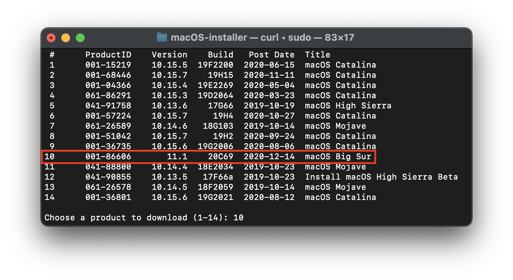
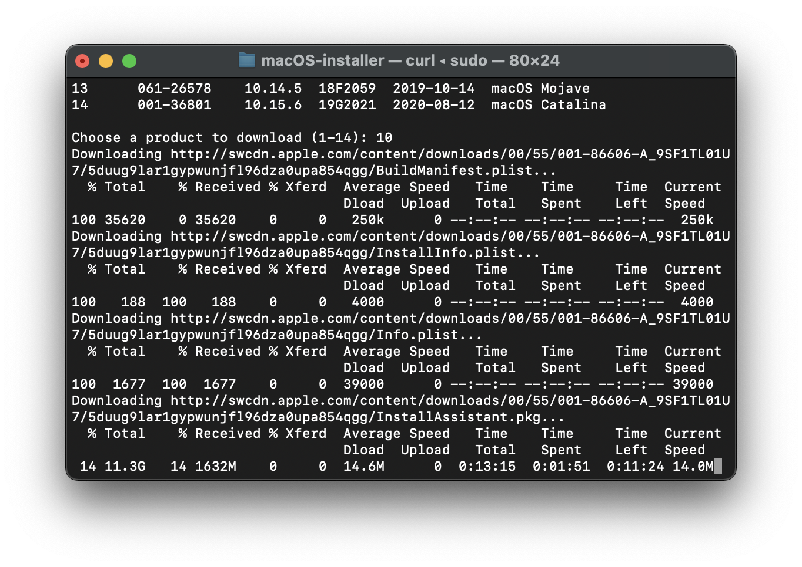
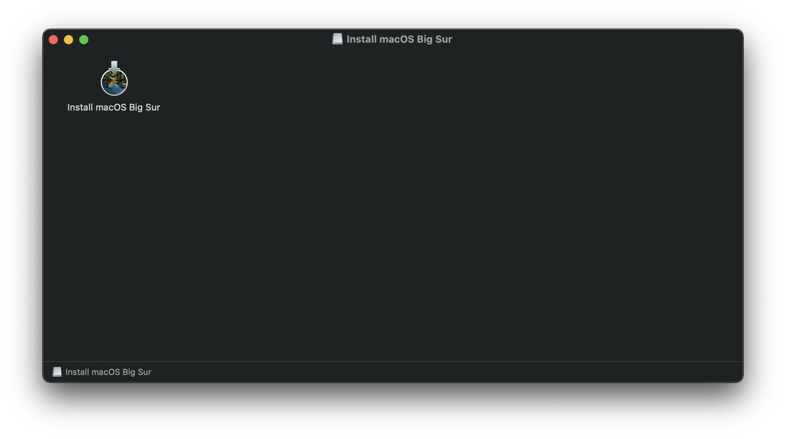
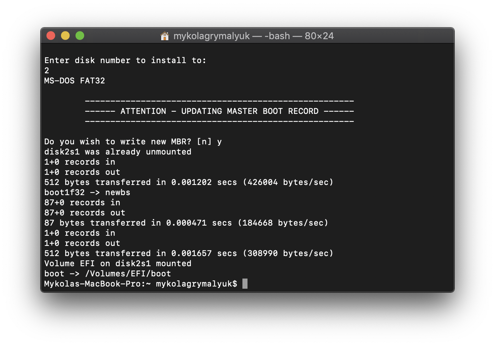
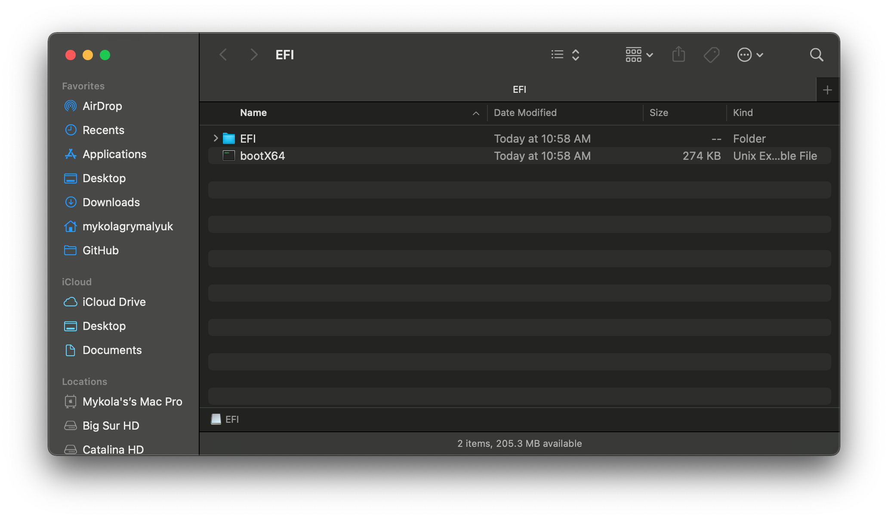

# Tạo bộ cài trong macOS

Trong khi bạn không cần phải có macOS mới có thể sử dụng OpenCore, một số người prefer having a fresh slate with their boot manager upgrades.

Để bắt đầu, chúng tôi sẽ tải xuống một bộ cài macOS. Bạn có thể bỏ qua bước này và chuyển sang format USB nếu bạn chỉ tạo một bootable OpenCore USB chứ không phải là USB cài đặt. Đối với những người khác, bạn có thể tải xuống macOS từ App Store hoặc với  bằng tập lệnh của Munki.

## Tải bộ cài macOS: Modern OS

* Phương pháp này cho phép bạn tải xuống macOS 10.13 và các bản mới hơn, đối với 10.12 trở lên, hãy xem [Tải xuống macOS: Legacy OS](#tai-xuong-macos-legacy-os)

Đối với những máy Mac đáp ứng các yêu cầu của phiên bản macOS mà bạn muốn cài đặt, hãy truy cập vào App Store và tải xuống bộ cài macOS bạn mong muốn và tiếp tục [**Thiết lập bộ cài**](#thiet-lap-bo-cai).

Đối với các máy cần bộ cài macOS cụ thể hoặc không thể tải xuống từ App Store, bạn có thể sử dụng script InstallInstallMacOS của Munki.

Để chạy nó, bạn chỉ cần sao chép và dán lệnh dưới đây vào terminal:

```sh
mkdir ~/macOS-installer && cd ~/macOS-installer && curl -O https://raw.githubusercontent.com/munki/macadmin-scripts/main/installinstallmacos.py && sudo python installinstallmacos.py
```



Như bạn có thể thấy, chúng tôi nhận được một danh sách các bộ cài macOS. Nếu bạn cần một bản macOS cụ thể, bạn có thể chọn nó bằng cách nhập số bên cạnh nó. Đối với ví dụ này, chúng tôi sẽ chọn 10:



* **Lưu ý cho macOS 11, Big Sur**: Vì bản macOS này còn khá mới nên vẫn còn một số vấn đề với một số hệ thống cần giải quyết. Để biết thêm thông tin, hãy xem tại đây: [OpenCore và macOS 11: Big Sur](../extras/big-sur/README.md)
  * Đối với người mới, chúng tôi khuyên dùng macOS 10.15, Catalina
* **Lưu ý đối với Nvidia GPU**: Chắc chắn rằng  bạn đã xác minh xem phần cứng của bạn có hỗ trợ các bản macOS mới hơn hay không, hãy xem [Hardware Limitations](../macos-limits.md)

Quá trình tải xuống sẽ mất một lúc vì chúng ta đang tải xuống một bộ cài macOS 8GB +, vì vậy bạn nên đọc phần còn lại của guide trong khi chờ đợi.

Sau khi hoàn tất, bạn sẽ tìm thấy trong thư mục `~/macOS-Installer/` một file DMG chứa bộ cài macOS, VD: `Install_macOS_11.1-20C69.dmg`. Mount nó và bạn sẽ tìm thấy installer application.

* Lưu ý: Chúng tôi khuyên bạn nên di chuyển Install macOS.app vào thư mục `/Applications`, bởi vì chúng ta sẽ thực thi các lệnh từ đó.
* Note 2: Nhấn phím Cmd+Shift+G ở ngoài Finder sẽ giúp bạn dễ dàng chuyển đến `~/macOS-installer`




Từ đây, hãy chuyển đến [Thiết lập bộ cài](#setting-up-the-installer) để hoàn tất công việc của bạn.

## Tải bộ cài macOS: Legacy OS

* Phương pháp này cho phép bạn tải xuống các phiên bản OS X cũ hơn nhiều, hiện hỗ trợ tất cả các phiên bản OS X của Intel (từ 10.4 đến hiện tại)

  * [Legacy macOS: Bộ cài Offline](./mac-install-pkg.md)
    * Hỗ trợ từ 10.10-10.12
  * [Legacy macOS: Bộ cài Online (Hỗ trợ từ 10.7-10.15)](./mac-install-recovery.md)
    * Hỗ trợ từ 10.7-11
  * [Legacy macOS: Disk Images](./mac-install-dmg.md)
    * Hỗ trợ từ 10.4-10.6

## Thiết lập bộ cài

Bây giờ chúng tôi sẽ format USB để chuẩn bị cho quá trình cài đặt macOS và OpenCore. Chúng ta sẽ sử dụng macOS Extended (HFS+) với GUID partition map. Thao tác này sẽ tạo ra hai phân vùng: phân vùng chính là `MyVolume` và phân vùng thứ hai có tên là `EFI` được sử dụng làm phân vùng khởi động, nơi firmware của máy tính sẽ kiểm tra các tệp khởi động (boot files).

* Lưu ý: Theo mặc định, Disk Utility chỉ hiển thị các phân vùng - nhấn Cmd/Win+2 để hiển thị tất cả các thiết bị (hoặc bạn có thể nhấn nút View)
* Note 2: Người dùng follow phần "Legacy macOS: Online method" có thể bỏ qua và đi đến phần [Thiết lập OpenCore EFI](#thiet-lap-opencore-efi)


Tiếp theo, hãy chạy lệnh `createinstallmedia` do [Apple](https://support.apple.com/en-us/HT201372) cung cấp. Lưu ý rằng lệnh được viết cho USB được format với tên `MyVolume`:

```sh
sudo /Applications/Install\ macOS\ Big\ Sur.app/Contents/Resources/createinstallmedia --volume /Volumes/MyVolume
```

Điều này sẽ mất một chút thời gian đủ để bạn có thể làm một ly cà phê hoặc tiếp tục đọc hướng dẫn (công bằng mà nói, bạn nên đọc toàn bộ guide trước khi làm theo guide này).

Bạn cũng có thể thay thế đường dẫn `createinstallmedia` bằng đường dẫn nơi chứa bộ cài của bạn (tương tự với tên ổ đĩa).
::: Chi tiết về Legacy createinstallmedia Commands

Được lấy từ trang web của chính thức của Apple: [Cách tạo USB cài macOS](https://support.apple.com/en-us/HT201372)

```sh
# Big Sur
sudo /Applications/Install\ macOS\ Big\ Sur.app/Contents/Resources/createinstallmedia --volume /Volumes/MyVolume

# Catalina
sudo /Applications/Install\ macOS\ Catalina.app/Contents/Resources/createinstallmedia --volume /Volumes/MyVolume

# Mojave
sudo /Applications/Install\ macOS\ Mojave.app/Contents/Resources/createinstallmedia --volume /Volumes/MyVolume

# High Sierra
sudo /Applications/Install\ macOS\ High\ Sierra.app/Contents/Resources/createinstallmedia --volume /Volumes/MyVolume

# Sierra
sudo /Applications/Install\ macOS\ Sierra.app/Contents/Resources/createinstallmedia --volume /Volumes/MyVolume --applicationpath /Applications/Install\ macOS\ Sierra.app

# El Capitan
sudo /Applications/Install\ OS\ X\ El\ Capitan.app/Contents/Resources/createinstallmedia --volume /Volumes/MyVolume --applicationpath /Applications/Install\ OS\ X\ El\ Capitan.app

# Yosemite
sudo /Applications/Install\ OS\ X\ Yosemite.app/Contents/Resources/createinstallmedia --volume /Volumes/MyVolume --applicationpath /Applications/Install\ OS\ X\ Yosemite.app

# Mavericks
sudo /Applications/Install\ OS\ X\ Mavericks.app/Contents/Resources/createinstallmedia --volume /Volumes/MyVolume --applicationpath /Applications/Install\ OS\ X\ Mavericks.app --nointeraction
```

:::

## Thiết lập cho Legacy

Đối với những máy không hỗ trợ UEFI, hãy xem bên dưới:

::: details Thiết lập Legacy Boot

Để bắt đầu, bạn cần những thứ sau:

* BootInstall_IA32.tool hoặc BootInstall_X64.tool
  * Chúng có thể được tìm thấy trong OpenCorePkg dưới `/Utilties/LegacyBoot/`
* Install USB(Đã tạo ở trên)

Trong thư mục OpenCore, chuyển đếnn `Utilities/LegacyBoot`. Tại đây, bạn sẽ tìm thấy một tệp có tên là `BootInstall_ARCH.tool`.Nó sẽ cài đặt DuetPkg vào USB của bạn.


Bây giờ hãy chạy tool này trong terminal **với quyền sudo**(Không thì công cụ này có lẽ sẽ bị lỗi):

```sh
# Replace X64 with IA32 if you have a 32-Bit CPU
sudo ~/Downloads/OpenCore/Utilities/legacyBoot/BootInstall_X64.tool
```


Điều này sẽ cung cấp cho bạn danh sách các đĩa có sẵn, chọn đĩa của bạn và bạn sẽ được nhắc write a new MBR. Chọn yes`[y]` và bạn sẽ hoàn tất.





Điều này sẽ cung cấp cho bạn một phân vùng EFI với tệp **bootia32** hoặc **bootx64**

:::

## Thiết lập OpenCore EFI

Thiết lập OpenCore EFI khá đơn giản – tất cả những gì bạn cần làm là mount phân vùng EFI của bạn. Phân vùng này sẽ được tạo tự động khi chúng ta định dạng bằng GUID nhưng được unmounted theo mặc định, đây là nơi mà người bạn của chúng tôi [MountEFI](https://github.com/corpnewt/MountEFI) tham gia:


Bạn sẽ nhận thấy rằng khi chúng ta mở phân vùng EFI, nó trống rỗng. Đây là nơi mọi chuyện vui vẻ bắt đầu.


## Bây giờ khi mọi thứ đã hoàn thành, hãy truy cập [Thiết lập EFI](./opencore-efi.md) để hoàn thành công việc của mình
