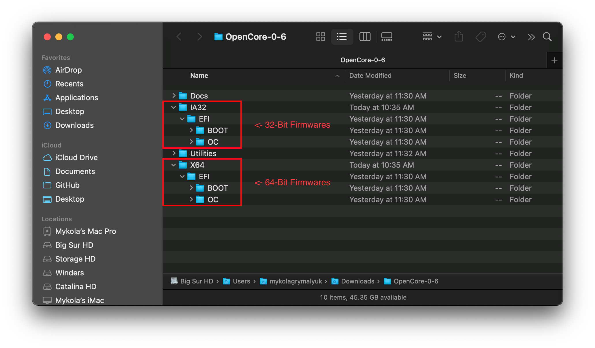
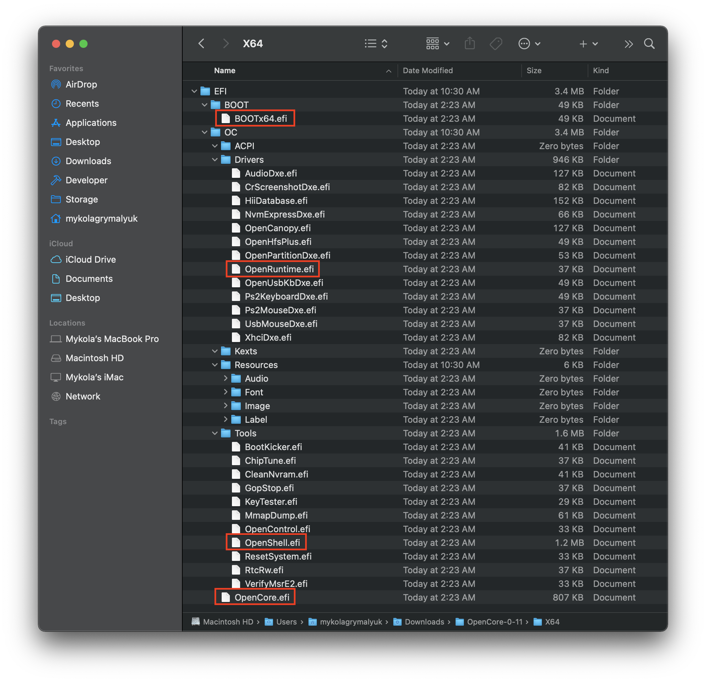
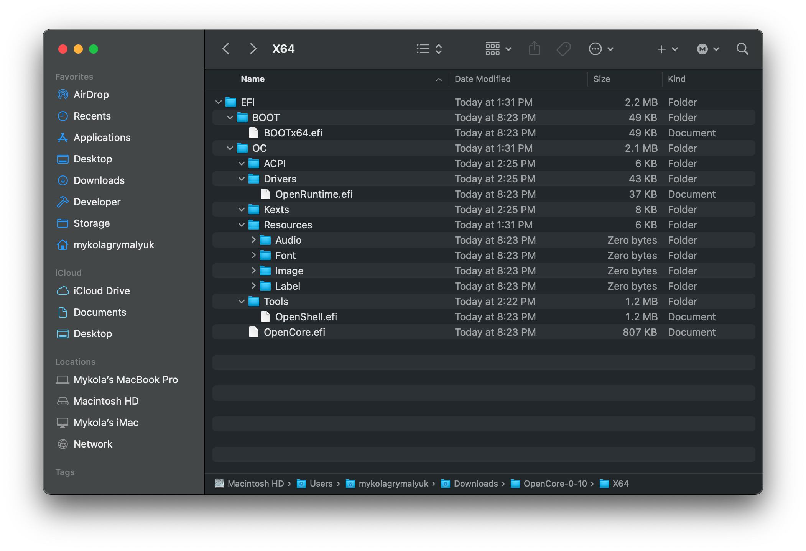
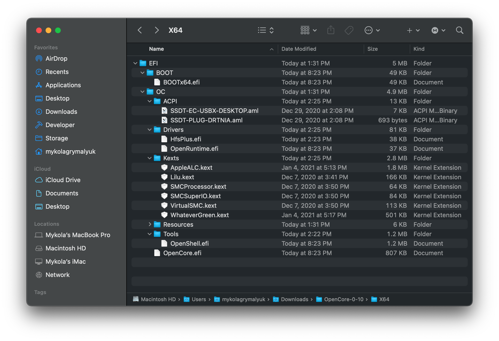

# Thêm các tệp OpenCore cơ sở

Để thiết lập cấu trúc thư mục OpenCore, bạn sẽ cần thư mục EFI được tìm thấy trong [OpenCorePkg's releases](https://github.com/acidanthera/OpenCorePkg/releases/). Lưu ý rằng chúng sẽ xuất hiện dưới dạng thư mục IA32 hoặc X64, cái trước là dành cho Firmware 32-bit và cái sau là dành cho Firmware 64-bit:

Về phiên bản DEBUG so với RELEASE:

* **DEBUG**: Cực kỳ hữu ích trong việc sửa lỗi khởi động, tuy nhiên sẽ gây ra một chút chậm trễ về thời gian khởi dộng(VD. Mất 3-5 giây để tới mục picker). Một khi đã cài bạn có thê dễ dàng chuyển đổi sang RELEASE
* **RELEASE**: Có tốc độ khởi động nhanh hơn, tuy nhiên không có thông tin DEBUG hữu ích được cung cấp trong OpenCore khiến việc xử lý sự cố khó hơn.

Và một khi đã tải về, đặt thư mục EFI(từ OpenCorePkg) trong phân vùng EFI của USB bạn:

**Lưu ý**:

* **Người dùng Windows:** bạn sẽ cân phải đặt thư mục EFI ở trong USB mà bạn tạo từ trước
* **Người dùng Linux:** Đấy chính là phân vùng `OPENCORE` mà chúng ta đã tạo từ trước
  * Lưu ý rằng Phương pháp 1 chỉ tạo ra 1 phân vùng, trong khi Phương pháp 2 tạo ra 2 phân vùng

Bây giờ hãy mở thư mục EFI và xem có những gì bên trong:

Bây giờ bạn sẽ thấy rằng nó đi kèm với rất nhiều tệp trong thư mục `Drivers` và `Tools`, chúng tôi không cần đa phần những thứ này:

* **Hãy giữ lại từ thư mục Drivers**(nếu có thể):

| Drivers | Trạng thái | Mô tả |
| :--- | :--- | :--- |
| OpenUsbKbDxe.efi |  Tuỳ vào  | Cần có cho hệ thống không có UEFI(trước-2012) |
| OpenPartitionDxe.efi | ^^ | Cần có để khởi động vào chế độ Khôi phục của macOS 10.7-10.9 |
| OpenRuntime.efi |  Cần có  | Cần có để hoạt động bình thường |

::: details Thông tin thêm về driver được cung cấp

* AudioDxe.efi
  * Không liên quan đến hỗ trợ âm thanh trong macOS
* CrScreenshotDxe.efi
  * Dùng để chụp ảnh màn hình trong UEFI, chúng ta không cần thứ này
* HiiDatabase.efi
  * Dùng để sửa phần hỗ trợ GUI như OpenShell.efi trên Sandy Bridge and và cũ hơn
  * Không cần thiết khi khởi động
* NvmExpressDxe.efi
  * Dùng cho Haswell và cũ hơn khi không có driver cho NVMe được gắn sẵn trong firmware
  * Không dùng khi bạn không biết bạn đang làm gì
* OpenCanopy.efi
  * Đây là lựa chọn GUI thêm cho OpenCore, chúng ta sẽ đi tìm hiểu cách thiết lập nó trong [Post Install](https://viopencore.github.io/OpenCore-Post-Install/cosmetic/gui.html) nên tạm thời chúng ta hãy bỏ nó
* OpenHfsPlus.efi
  * Driver HFS Plus mã nguồn mở, khá chậm nên chúng tôi khuyến khích không dùng trừ khi bạn biết bạn đang làm gì.
* OpenPartitionDxe.efi
  * Cần có để khởi động vào chế độ Khôi phục của OS X 10.7 tới 10.9
    * Lưu ý: Ngươi dùng OpenDuet(VD. không có UEFI) sẽ có driver này được gắn sẵn, không cần có nó
* OpenUsbKbDxe.efi
  * Dùng cho OpenCore picker trên **hệ thống legacy dùng DuetPkg**, [không khuyến khích và thậm chí có hại trên Ivy Bridge và mới hơn](https://applelife.ru/threads/opencore-obsuzhdenie-i-ustanovka.2944066/page-176#post-856653)
* Ps2KeyboardDxe.efi + Ps2MouseDxe.efi
  * Khá là hiển nhiên khi bạn cần tới thứ này, người dùng bàn phím và chuột USB không cần nó
  * Nhắc nhở: PS2 ≠ USB
* UsbMouseDxe.efi
  * Ý tưởng giống với OpenUsbKbDxe, chỉ nên dùng trên hệ thống legacy dùng DuetPkg
* XhciDxe.efi
  * Dùng cho Sandy Bridge và cũ hơn khi không có driver XHCI được gắn sẵn trong firmware
  * Chỉ cần thiết khi bạn đang sử dụng card mở rộng USB 3.0 ở những kiểu máy cũ hơn

:::

* **Hãy giữ lại từ thư mục Tools:**

| Tools | Trạng thái | Mô tả |
| :--- | :--- | :--- |
| OpenShell.efi |  Tuỳ vào  | Khuyến khích để gỡ lỗi dễ dàng hơn |

EFI sau khi dọn dẹp:

Bây giờ bạn có thể đặt những driver firmware(.efi) cần thiết **của bạn** vào trong thư mục _Drivers_ và thư mục Kexts/ACPI tới từng vị trí tương ứng với chúng. Xem [Gathering Files](../ktext.md) để biết thêm thông tin về những tệp mà bạn nên dùng

* Lưu ý rằng driver UEFI từ Clover không được hỗ trợ bởi OpenCore!(EmuVariableUEFI, AptioMemoryFix, OsxAptioFixDrv, v.v). Hãy xem [Clover firmware driver conversion](https://github.com/dortania/OpenCore-Install-Guide/blob/master/clover-conversion/clover-efi.md) để biết thêm thông tin về những driver được hỗ trợ và những thứ được nhập với OpenCore.

Đây là những EFI phổ biến ***có thể*** nhìn như thế nào (của bạn sẽ trông khác so với hình ảnh):

**Nhắc nhở**:

* SSDT và DSDT tuỷ chỉnh(`.aml`) được chứa trong thư mục ACPI
* Kexts(`.kext`) được chứa trong thư mục Kexts
* Firmware drivers(`.efi`) được chứa trong thư mục Drivers

# Và sau khi hoàn thành, đi tới [Gathering Files](../ktext.md) để tìm hiểu những kext và driver firmware mà bạn cần
