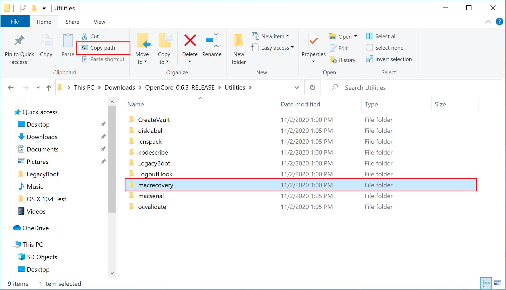
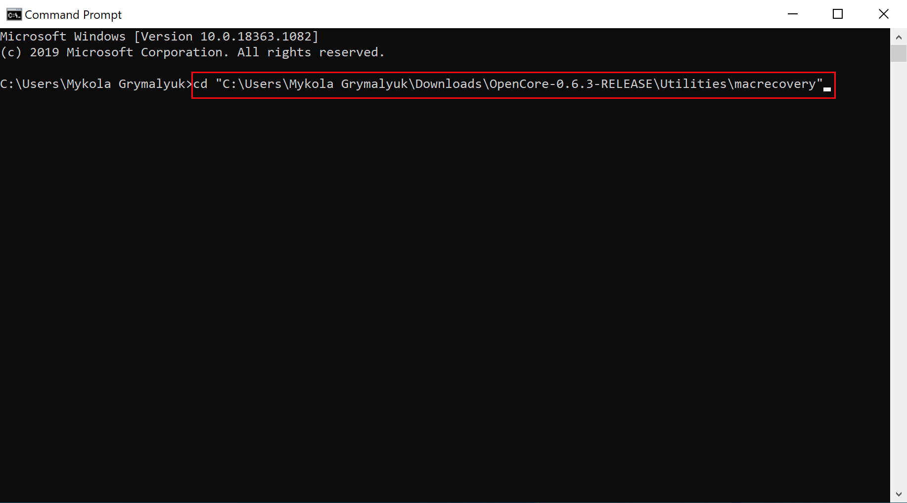
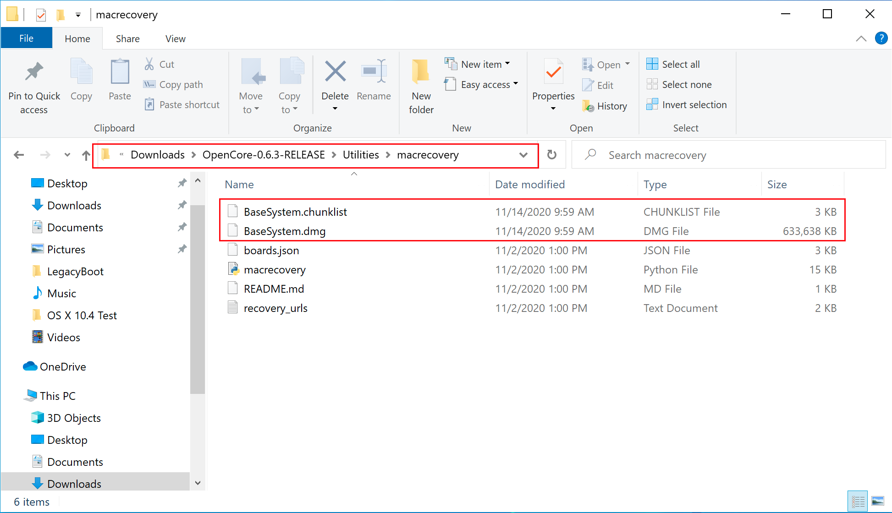
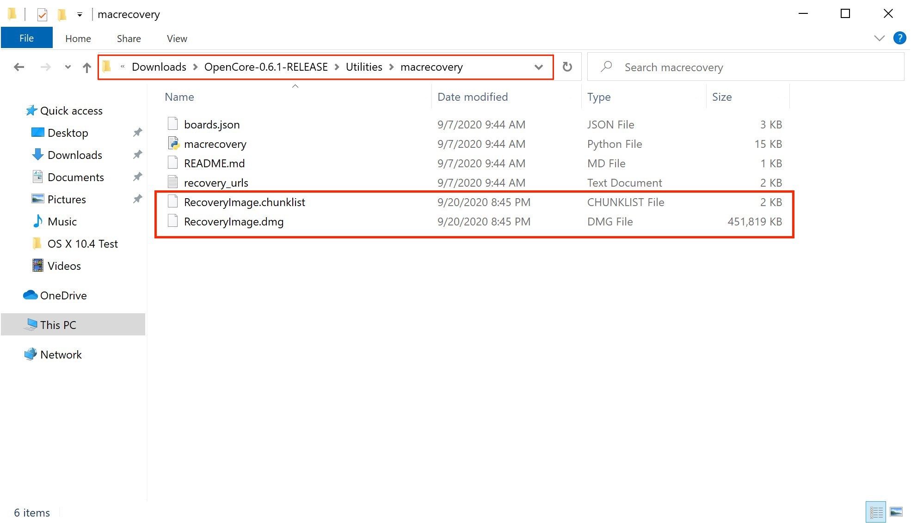
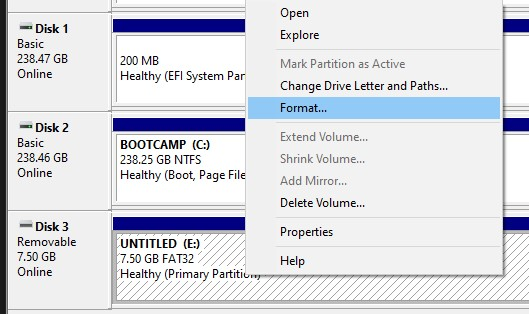
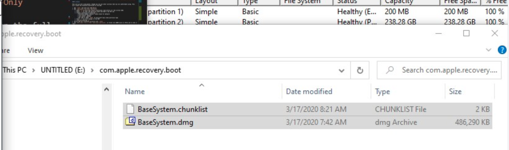
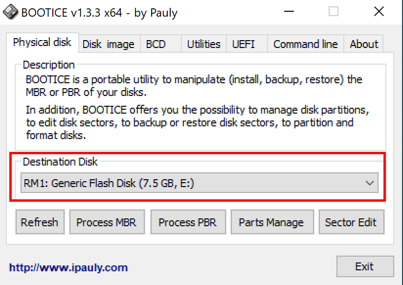
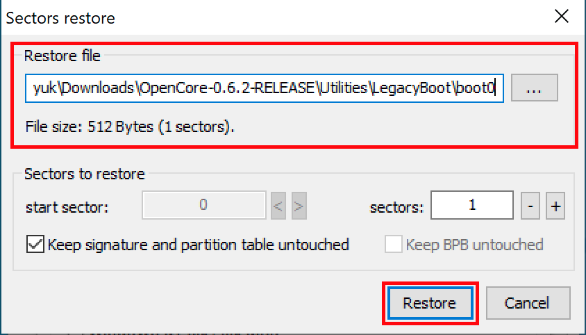
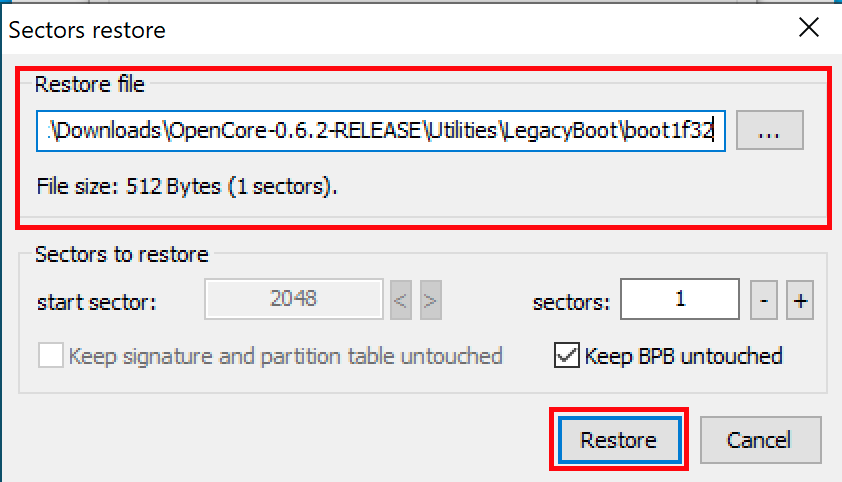

# Tạo bộ cài trong Windows

Trong khi bạn không cần phải có macOS mới có thể sử dụng OpenCore, một số người lại thích có fresh slate và update boot manager của họ.

Để bắt đầu bạn cần những thứ sau:

* Một USB 4GB

* Đối với những USB có dung lượng lớn hơn 16 GB thì để format nó thành FAT32 hãy sử dụng [Rufus](#su-dung-rufus)

* [macrecovery.py](https://github.com/acidanthera/OpenCorePkg/releases)
  * Muốn chạy được script thì bạn phải cài [Python](https://www.python.org/downloads/)

## Tải bộ cài macOS

Để tải các bộ cài legacy cực kỳ dễ dàng, trước tiên hãy tải xuống [OpenCorePkg](https://github.com/acidanthera/OpenCorePkg/releases)và truy cập vào `/Utilities/macrecovery/`. Tiếp theo sao chép đường dẫn đến thư mục macrecovery:



Từ đây, bạn sẽ mở Command Prompt (cmd) và cd vào thư mục macrecovery mà chúng ta đã sao chép đường dẫn trước đó:

```sh
cd Paste_Folder_Path
```



Bây giờ hãy chạy một trong các scripts sau tùy thuộc vào bản macOS bạn muốn (Lưu ý rằng các tập lệnh này cần có [Python](https://www.python.org/downloads/) để chạy, vui lòng cài đặt nếu bạn chưa có):

```sh
# Lion(10.7):
python macrecovery.py -b Mac-2E6FAB96566FE58C -m 00000000000F25Y00 download
python macrecovery.py -b Mac-C3EC7CD22292981F -m 00000000000F0HM00 download

# Mountain Lion(10.8):
python macrecovery.py -b Mac-7DF2A3B5E5D671ED -m 00000000000F65100 download

# Mavericks(10.9):
python macrecovery.py -b Mac-F60DEB81FF30ACF6 -m 00000000000FNN100 download

# Yosemite(10.10):
python macrecovery.py -b Mac-E43C1C25D4880AD6 -m 00000000000GDVW00 download

# El Capitan(10.11):
python macrecovery.py -b Mac-FFE5EF870D7BA81A -m 00000000000GQRX00 download

# Sierra(10.12):
python macrecovery.py -b Mac-77F17D7DA9285301 -m 00000000000J0DX00 download

# High Sierra(10.13)
python macrecovery.py -b Mac-7BA5B2D9E42DDD94 -m 00000000000J80300 download
python macrecovery.py -b Mac-BE088AF8C5EB4FA2 -m 00000000000J80300 download

# Mojave(10.14)
python macrecovery.py -b Mac-7BA5B2DFE22DDD8C -m 00000000000KXPG00 download

# Catalina(10.15)
python macrecovery.py -b Mac-00BE6ED71E35EB86 -m 00000000000000000 download

# Latest version
# ie. Big Sur(11)
python macrecovery.py -b Mac-E43C1C25D4880AD6 -m 00000000000000000 download
```

* **Lưu ý cho macOS 11, Big Sur**: Vì bản macOS này còn khá mới nên vẫn còn một số vấn đề với một số hệ thống cần giải quyết. Để biết thêm thông tin, hãy xem tại đây: [OpenCore và macOS 11: Big Sur](../extras/big-sur/README.md)
  * Đối với newbie, chúng tôi khuyên dùng macOS 10.15, Catalina
* **Lưu ý đối với Nvidia GPU**: Chắc chắn rằng  bạn đã xác minh xem phần cứng của bạn có hỗ trợ các bản macOS mới hơn hay không, hãy xem [Hardware Limitations](../macos-limits.md)

Việc này sẽ mất một chút thời gian, tuy nhiên sau khi hoàn tất, bạn sẽ tìm thấy tệp BaseSystem hoặc RecoveryImage:


| BaseSystem | RecoveryImage |
| :--- | :--- |
| |  |

Bây giờ sau khi chúng ta đã tải bộ cài xuống, tiếp theo chúng ta sẽ format USB.

## Tạo bộ cài

Here we'll be formatting our USB and adding macOS onto it, we have 2 options:

* [Sử dụng Disk Management](#su-dung-disk-management)
  * Dựa trên GUI, cách đơn giản nhất
  * Chỉ máy UEFI mới được hỗ trợ(ex. 2012+)
* [Sử dụng Rufus](#su-dung-rufus)
  * Dựa trên GUI, cách đơn giản nhất
  * Đối với USB có dung lượng lớn hơn(16GB+)
* [Sử dụng diskpart](#su-dung-diskpart)
  * Dựa trên command, ít công việc hơn
  * Bắt buộc đối với các máy legacy(VD:non-UEFI, pre-2012)

### Sử dụng Disk Management

Chỉ cần mở Disk Management và format USB của bạn thành FAT32:

1. Nhấp chuột phải vào nút Start trên thanh tác vụ của bạn và chọn Disk Management.
2. Bạn sẽ thấy tất cả các partitions và ổ đĩa của mình. Ở phần dưới, bạn sẽ tìm thấy USB của mình.
3. Bạn sẽ muốn format USB thành FAT32.

* Nếu bạn có nhiều phân vùng trên USB, hãy nhấp chuột phải vào từng phân vùng và nhấp vào Delete Volume cho USB của bạn (Thao tác này sẽ xóa dữ liệu, đảm bảo bạn có bản sao lưu và chỉ xóa phân vùng khỏi USB của bạn)
  * Nhấp chuột phải vào unallocated space và tạo một volume mới. Đảm bảo rằng nó là FAT32 và ít nhất là một hoặc hai gigabyte. Đặt tên nó là "EFI".
* Nếu không, hãy nhấp chuột phải vào phân vùng trên USB và format nó thành FAT32.



Tiếp theo, truy cập root của USB này và tạo một thư mục có tên là `com.apple.recovery.boot`. Sau đó, di chuyển các tệp BaseSystem hoặc RecoveryImage đã tải xuống. Hãy đảm bảo bạn sao chép cả tệp .dmg và .chunklist vào thư mục này:



Bây giờ hãy mở OpenCorePkg mà bạn đã tải xuống trước đó:


Ở đây chúng ta có thể thấy cả hai thư mục IA32 (32 Bit CPU) và X64 (64 Bit CPU), hãy chọn thư mục phù hợp nhất với phần cứng của bạn và mở nó. Tiếp theo, lấy thư mục EFI bên trong và đặt nó vàoroot của USB bên cạnh com.apple.recovery.boot. Sau khi hoàn thành, nó sẽ trông như thế này:


### Sử dụng Rufus

1. Tải [Rufus](https://rufus.ie/) xuống
2. Đặt BOOT selection là not bootable
3. Đặt File System là Large FAT32
4. Nhấp Start
5. Xóa tất cả file autorun trong USB


Tiếp theo, truy cập root của USB này và tạo một thư mục có tên là `com.apple.recovery.boot`. Sau đó, di chuyển các tệp BaseSystem hoặc RecoveryImage đã tải xuống. Hãy đảm bảo bạn sao chép cả tệp .dmg và .chunklist vào thư mục này:


Bây giờ hãy mở OpenCorePkg mà bạn đã tải xuống trước đó:


Ở đây chúng ta có thể thấy cả hai thư mục IA32 (32 Bit CPU) và X64 (64 Bit CPU), hãy chọn thư mục phù hợp nhất với phần cứng của bạn và mở nó. Tiếp theo, lấy thư mục EFI bên trong và đặt nó vàoroot của USB bên cạnh com.apple.recovery.boot. Sau khi hoàn thành, nó sẽ trông như thế này:


### Sử dụng diskpart

::: details Sử dụng diskpart

Nhấn Windows + R và gõ `diskpart`.

Bây giờ thì chạy các lệnh sau:

```sh
# List available disks
list disk
# Select your disk(ie. disk 1)
select disk 1
# Format the drive
clean
# Convert to GPT
# Due to an odd bug with BOOTICE and DuetPkg, MBR disks will fail to boot
convert gpt
# Create a new partition
create partition primary
# Select your partition
# Running clean ensures we only have 1 partition so it will be "partition 1"
select partition 1
# Format the drive as FAT32
format fs=fat32 quick
# Assign a drive letter(ie. Drive E, ensure it's not currently in use)
ASSIGN LETTER=E
```

Tiếp theo, truy cập root của USB này và tạo một thư mục có tên là `com.apple.recovery.boot`. Sau đó, di chuyển các tệp BaseSystem hoặc RecoveryImage đã tải xuống. Hãy đảm bảo bạn sao chép cả tệp .dmg và .chunklist vào thư mục này:


Bây giờ hãy mở OpenCorePkg mà bạn đã tải xuống trước đó:


Ở đây chúng ta có thể thấy cả hai thư mục IA32 (32 Bit CPU) và X64 (64 Bit CPU), hãy chọn thư mục phù hợp nhất với phần cứng của bạn và mở nó. Tiếp theo, lấy thư mục EFI bên trong và đặt nó vàoroot của USB bên cạnh com.apple.recovery.boot. Sau khi hoàn thành, nó sẽ trông như thế này:


::: details Thiết lập Legacy Install

Nếu firmware của bạn không hỗ trợ UEFI, hãy xem hướng dẫn bên dưới:

Để bắt đầu, bạn sẽ cần những thứ sau:

* [7-Zip](https://www.7-zip.org)
* [BOOTICE](https://www.majorgeeks.com/files/details/bootice_64_bit.html)
* [OpenCorePkg](https://github.com/acidanthera/OpenCorePkg/releases)

Tiếp theo, mở BOOTICE và đảm bảo bạn đã chọn đúng USB của bạn.



Tiếp theo, nhập "Process MBR" rồi chọn "Restore MBR" và chọn tệp **boot0** từ `Utilities/LegacyBoot/` trong OpenCorePkg:

| Restore MBR | Restore boot0 file |
| :--- | :--- |
|  |  |

Sau đó quay lại màn hình chính và chọn "Process PBR" rồi chọn "Restore PBR". Từ đây, hãy chọn tệp **Boot1f32** từ `Utilities/LegacyBoot/` trong OpenCorePkg:

| Restore PBR | Restore boot1f32 file |
| :--- | :--- |
|  |  |

Sau khi hoàn tất, hãy quay lại USB của bạn và thực hiện 1 việc cuối cùng. Lấy tệp **bootx64** (64 Bit CPU) hoặc **bootia32** (32 Bit CPU) từ `Utilities/LegacyBoot/ 'và đặt nó vào root của USB. **Đổi tên tệp này thành boot** để đảm bảo DuetPkg có thể hoạt động bình thường:


:::

## Bây giờ khi mọi thứ đã hoàn thành, hãy truy cập [Thiết lập EFI](./opencore-efi.md) để hoàn thành công việc của mình
