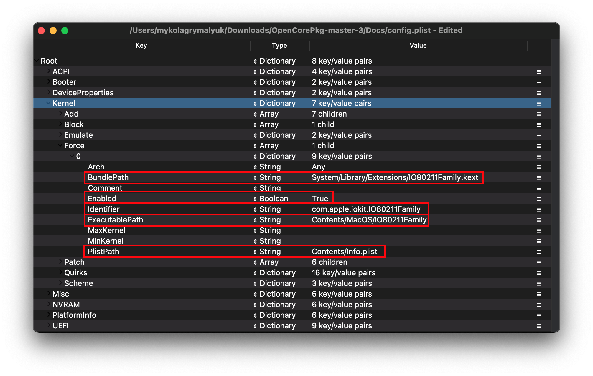

# Các file cần thiết

Đây chính là phần hướng dẫn bạn tải các file cần thiết để khởi động macOS, chúng tôi chắc rằng bạn đã nắm rõ về phần cứng của bạn trước khi bắt đầu nghiên cứu sâu hơn tại đây.

> Cách nào tốt nhất để biết được rằng phần cứng của bạn được hỗ trợ?

Xem [**Hardware Limitations page**](macos-limits.md) để có cái nhìn tốt hơn về việc macOS cần gì để khởi động, Hỗ trợ phần cứng giữa Clover và OpenCore khá giống nhau.

> Cách naò để chỉ ra phần cứng mà tôi có?

Nhìn vào trang trước: [Tìm hiểu cấu hình](./find-hardware.md)

## Driver Firmware

Driver Firmware là những driver dùng bởi OpenCore trong môi trường UEFI. Chúng chủ yếu cần để boot máy lên, với cả kéo dài khả năng patch của OpenCore hoặc hiển thị cho bạn những loại ổ đĩa khác nhau trong OpenCore picker(VD. ổ đĩa HFS)

* **Lưu ý địa điểm**: Những tệp **cần** phải được để dưới `EFI/OC/Drivers/`

### Phần chung cho mọi máy

::: tip Những driver được yêu cầu

Cho hầu hết các máy tính, bạn sẽ chỉ cần 2 driver `.efi`  để chạy:

* [HfsPlus.efi](https://github.com/acidanthera/OcBinaryData/blob/master/Drivers/HfsPlus.efi)(<span style="color:red">Bắt buộc</span>)
  * Cần có để read phân vùng HFS(VD. macOS Installers và Recovery partitions/images). **Không được hoà trộn với các driver HFS khác**
  * Còn đối với Sandy Bridge và các CPU đời cũ hơn(Và cả dòng  low end Ivy Bridge(i3 and Celerons), xem phần legacy bên dưới
* [OpenRuntime.efi](https://github.com/acidanthera/OpenCorePkg/releases)(<span style="color:red">Bắt buộc</span>)
  * Thay thế cho [AptioMemoryFix.efi](https://github.com/acidanthera/AptioFixPkg), dùng như là extension của OpenCore để giúp patch boot.efi nhằm fix NVRAM và giúp quản lý pin tốt hơn.
  * Lưu là nó nằm trong thư mục OpenCorePkg mà chúng ta download ở trước (không phải tải lại).

:::

### Người dùng Legacy

In addition to the above, nếu phần cứng của bạn không hỗ trợ UEFI(2011 và trở về trước) thì bạn sẽ cần thứ tiếp theo. Nhìn kĩ vào từng entry vì có thể bạn không cần cả 4:

* [OpenUsbKbDxe.efi](https://github.com/acidanthera/OpenCorePkg/releases)
  * Dùng cho OpenCore picker trên **các máy legacy sử dụng DuetPkg**, [không được khuyến khích và đôi khi còn gây hại cho máy UEFI(Ivy Bridge và đời mới hơn)](https://applelife.ru/threads/opencore-obsuzhdenie-i-ustanovka.2944066/page-176#post-856653)
* [HfsPlusLegacy.efi](https://github.com/acidanthera/OcBinaryData/blob/master/Drivers/HfsPlusLegacy.efi)
  * Legacy variant of HfsPlus, used for systems that lack RDRAND instruction support. This is generally seen on Sandy Bridge and older(as well as low end Ivy Bridge(i3 and Celerons))
  * Không hoà trộn nó với HfsPlus.efi, chọn một hoặc là cái khác tuỳ theo phần cứng của bạn
* [OpenPartitionDxe](https://github.com/acidanthera/OpenCorePkg/releases)
  * Cần có để khởi động vào recovery trên OS X 10.7 tới 10.9
    * Tệp được bao gồm trong OpenCorePkg phần EFI/OC/Drivers
    * Lưu ý: Người dùng OpenDuet(VD: không UEFI) sẽ có driver này được thích hợp sẵn, không cần nó
  * Không cần thiết cho OS X 10.10, Yosemite và mới hơn

Những tệp này sẽ nằm trong thư mục Drivers trong EFI của bạn

::: Chi tiết cụ thể về Driver cho 32-Bit

Với những CPU 32-Bit, bạn cũng sẽ cần tải các tệp này

* [HfsPlus32](https://github.com/acidanthera/OcBinaryData/blob/master/Drivers/HfsPlus32.efi)
  * Thay thế HfsPlusLegacy nhưng dành cho CPU 32-bit, không dùng chung với driver HFS .efi khác

:::

## Kexts

Kext là viết tắt của **k**ernel **ext**ension, bạn có thể xem nó như là là driver cho macOS, những file này sẽ được đặt tại thư mục Kexts ở trong EFI của bạn.

* **Lưu ý cho Windows và Linux**: File kexts sẽ trông như những thư mục bình thường trong OS của bạn, **kiểm tra lại** thư mục mà bạn đang sử dụng phải có extension là .kext (và không được thêm vào nếu nó bị thiếu).
  * Nếu một số kext bao gồm cả tập `.dSYM`, bạn chỉ cần xoá nó đi. Nó chỉ cần trong việc debug.
* **Lưu ý về địa điểm**: Những file này **phải** được nằm trong thư mục `EFI/OC/Kexts/`.

Tất cả kext được nêu dưới đây đều được **compile sẵn** trong [Kext Repo](http://kexts.goldfish64.com/). Kexts ở đây được compiled mỗi khi có một commit mới.

### Buộc phải có

::: Kext bắt buộc phải có

Nếu không có kext bên dưới, không có máy nào có thể boot được:

* [VirtualSMC](https://github.com/acidanthera/VirtualSMC/releases)(<span style="color:red">Bắt buộc</span>)
  * Giả lập lại chip SMC chip có trên real Mac, không có thì macOS sẽ không thể boot
  * Có thể được thay bằng FakeSMC (có thể hỗ trợ tốt hơn hoặc kém hơn), được sử dụng rộng rãi trong các phần cứng legacy.
  * Yêu cầu OS X 10.6 hoặc mới hơn
* [Lilu](https://github.com/acidanthera/Lilu/releases)(<span style="color:red">Bắt buộc</span>)
  * Một kext dung để patch nhiều process, cần có cho AppleALC, WhateverGreen, VirtualSMC và nhiều kext khác. Không có Lilu, chúng sẽ không thể hoạt động được.
  * Lưu ý rằng Lilu và các plugin cần OS X 10.8 hoặc mới hơn để hoạt động
  
::: Chi tiết  Những kexts buộc phải có cho Legacy

Dành cho những ai định boot OS X 10.7 và các bản cũ hơn trên phần cứng 32 bit, bạn sẽ phải sử dụng kext sau thay cho VirtualSMC:

* [FakeSMC-32](https://github.com/khronokernel/Legacy-Kexts/blob/master/32Bit-only/Zip/FakeSMC-32.kext.zip?raw=true)

Lưu ý rằng nếu bạn định boot những OS cũ như vậy, bạn có thể không cần kext.

* **Lưu ý cho OS X 10.4 và 10.5**: Ngay cả trên CPU 64-bit, nhân của OS X vẫn là 32-bit. Nên chúng tôi khuyên bạn sử dụng FakeSMC-32 song song với VirtualSMC, đặc biệt là thiết lập entry FakeSMC-32 `Arch` thành `i386` và VirtualSMC thành `x86_64`. Chúng ta sẽ thảo luận sâu hơn về việc này trong guide này

:::

### Các Plugin của VirtualSMC

Các Plugin bên dưới đều không cần thiết để khởi động, và đơn thuần thêm các chức năng cho hệ thống như hardware monitoring (Lưu ý tuy VirtualSMC hỗ trợ 10.6, plugin có thể cần phải có 10.8+):

* SMCProcessor.kext
  * Dùng để theo dõi nhiệt độ CPU, **không hoạt động trên CPU AMD**
* SMCSuperIO.kext
  * Dùng để theo dõi fan speed, **không hoạt động trên CPU AMD**
* SMCLightSensor.kext
  * Dùng cho cảm biến ánh sáng trên Laptop, **Desktop có thể bỏ qua**
  * Không dùng nếu bạn không có cảm biến ánh sáng, có thể gây ra nhiều lỗi khác
* SMCBatteryManager.kext
  * Dùng để đo và hiển thị thông tin pin trên Laptop, **Desktop có thể bỏ qua**
* SMCDellSensors.kext
  * Cho phép theo dõi tốt hơn và quản lý tốc độ quạt trên các máy Dell hỗ trợ System Management Mode(SMM)
  * **Không sử dụng nếu bạn không có máy Dell được hỗ trợ**, chủ yếu các máy Dell sẽ cần kext này

### Đồ hoạ

* [WhateverGreen](https://github.com/acidanthera/WhateverGreen/releases)(<span style="color:red">Bắt buộc</span>)
  * Dùng đề patch đồ hoạ DRM, boardID, framebuffer fixes, v.v, tất cả GPUs đều cần kext này.
  * Lưu ý rằng tệp SSDT-PNLF.dsl được bao gồm chỉ cần thiết cho laptop và AIO, xem [Getting started with ACPI](https://viopencore.github.io/Getting-Started-With-ACPI/) để biết thêm thông
  * Yêu cầu OS X 10.8 hoặc mới hơn

### Âm thanh

* [AppleALC](https://github.com/acidanthera/AppleALC/releases)
  * Dùng cho patch AppleHDA, cho phép sự hỗ trợ hầu hết các bộ điều khiển âm thanh on-board (trên bo mạch chủ)
  * AMD 15h/16h có thể sẽ gặp vấn đề về nó và hệ thống Ryzen/Threadripper ít hỗ trợ mic
  * Yêu cầu OS X 10.8 hoặc mới hơn
  
::: chi tiết Kext Legacy Audio

Dành cho những người dự định khởi động từ 10.7 và cũ hơn có thể sẽ phải sử dụng các kext này thay cho cái trên:

* [VoodooHDA](https://sourceforge.net/projects/voodoohda/)
  * Yêu cầu OS X 10.6 hoặc mới hơn
  
* [VoodooHDA-FAT](https://github.com/khronokernel/Legacy-Kexts/blob/master/FAT/Zip/VoodooHDA.kext.zip)
  * Giống như trên, tuy nhiên hỗ trợ kernel 32 và 64-Bit nên quá hoàn hảo cho việc khởi động OS X 10.4-5 và CPU 32-Bit

:::

### Ethernet

Tại đây chúng ta sẽ cùng nhau tim hiểu về card ethernet mà hệ thống của bạn là gì, nhắc nhở rẳng trang thông số của sản phẩm sẽ gần như liệt ra tên của loại card Ethernet.

* [IntelMausi](https://github.com/acidanthera/IntelMausi/releases)
  * Required for the majority of Intel NICs, chipsets that are based off of I211 will need the SmallTreeIntel82576 kext
  * Intel's 82578, 82579, I217, I218 and I219 NICs are officially supported
  * Requires OS X 10.9 or newer, 10.6-10.8 users can use the IntelSnowMausi instead for older OSes
* [SmallTreeIntel82576 kext](https://github.com/khronokernel/SmallTree-I211-AT-patch/releases)
  * Yêu cầu cho I211 NIC, dựa trên kext SmallTree nhỏ nhưng được patch để hỗ trợ I211
  * Yêu cầu cho đa số bo mạch chủ AMD dùng Intel NIC
  * Yêu cầu OS X 10.9-12(v1.0.6), macOS 10.13-14(v1.2.5), macOS 10.15+(v1.3.0)
* [AtherosE2200Ethernet](https://github.com/Mieze/AtherosE2200Ethernet/releases)
  * Required for Atheros and Killer NICs
  * Yêu cầu OS X 10.8 or newer
  * Note: Atheros Killer E2500 models are actually Realtek based, for these systems please use [RealtekRTL8111](https://github.com/Mieze/RTL8111_driver_for_OS_X/releases) instead
* [RealtekRTL8111](https://github.com/Mieze/RTL8111_driver_for_OS_X/releases)
  * Dành cho Realtek's Gigabit Ethernet
  * Yêu cầu OS X 10.8 and up for versions v2.2.0 and below, macOS 10.12 and up for versions v2.2.2 through v2.3.0 (inclusive), macOS 10.14 and up for versions v2.4.0 and up
  * **NOTE:** Sometimes the latest version of the kext might not work properly with your Ethernet. If you see this issue, try older versions.
* [LucyRTL8125Ethernet](https://www.insanelymac.com/forum/files/file/1004-lucyrtl8125ethernet/)
  * Cho Realtek's 2.5Gb Ethernet
  * Yêu cầu macOS 10.15 và mới hơn
* Cho Intel I225-V NIC, những patch đều được nhắc đến trong phần desktop [Comet Lake DeviceProperties](config.plist/comet-lake.md#deviceproperties). Không có kext được yêu cầu.
  * Yêu cầu macOS 10.15 và mới hơn
* Cho Intel I350 NIC, những patch đêu được nhắc đến trong phần HEDT [Sandy and Ivy Bridge-E DeviceProperties](config-HEDT/ivy-bridge-e.md#deviceproperties). Không có kext được yêu cầu.
  * Yêu cầu OS X 10.10 và mới hơn

::: details Kext Ethernet Legacy

Relevant for either legacy macOS installs or older PC hardware.

* [AppleIntele1000e](https://github.com/chris1111/AppleIntelE1000e/releases)
  * Mainly relevant for 10/100MBe based Intel Ethernet controllers
  * Yêu cầu 10.6 or newer
* [RealtekRTL8100](https://www.insanelymac.com/forum/files/file/259-realtekrtl8100-binary/)
  * Mainly relevant for 10/100MBe based Realtek Ethernet controllers
  * Yêu cầu macOS 10.12 và mới hơn với v2.0.0+
* [BCM5722D](https://github.com/chris1111/BCM5722D/releases)
  * Mainly relevant for BCM5722 based Broadcom Ethernet controllers
  * Dành cho OS X 10.6 và mới hơn

:::

And also keep in mind certain NICs are actually natively supported in macOS:

::: details Native Ethernet Controllers

#### Series Aquantia

```md
# AppleEthernetAquantiaAqtion.kext
pci1d6a,1    = Aquantia AQC107
pci1d6a,d107 = Aquantia AQC107
pci1d6a,7b1  = Aquantia AQC107
pci1d6a,80b1 = Aquantia AQC107
pci1d6a,87b1 = Aquantia AQC107
pci1d6a,88b1 = Aquantia AQC107
pci1d6a,89b1 = Aquantia AQC107
pci1d6a,91b1 = Aquantia AQC107
pci1d6a,92b1 = Aquantia AQC107
pci1d6a,c0   = Aquantia AQC113
pci1d6a,4c0  = Aquantia AQC113
```

**Lưu ý**: Vì có một số firmware lỗi thời được kèm theo trong nhiều Aquantia NIC, bạn có thể cân phải cập nhật firmware trong Linux/Windows để chắc chắn rằng nó tương thích với macOS.

#### Series Intel

```md
# AppleIntel8254XEthernet.kext
pci8086,1096 = Intel 80003ES2LAN
pci8086,100f = Intel 82545EM
pci8086,105e = Intel 82571EB/82571GB

# AppleIntelI210Ethernet.kext
pci8086,1533 = Intel I210
pci8086,15f2 = Intel I225LM (Added in macOS 10.15)

# Intel82574L.kext
pci8086,104b = Intel 82566DC
pci8086,10f6 = Intel 82574L

```

#### Series Broadcom

```md
# AppleBCM5701Ethernet.kext
pci14e4,1684 = Broadcom BCM5764M
pci14e4,16b0 = Broadcom BCM57761
pci14e4,16b4 = Broadcom BCM57765
pci14e4,1682 = Broadcom BCM57762
pci14e4,1686 = Broadcom BCM57766
```

:::

### USB

* [USBInjectAll](https://bitbucket.org/RehabMan/os-x-usb-inject-all/downloads/)
  * Used for injecting Intel USB controllers on systems without defined USB ports in ACPI
  * Shouldn't be needed on Desktop Skylake and newer
    * AsRock rất ngớ ngẩn và phải cần cái này
    * Coffee Lake và các laptop cũ hơn được khuyến khích sử dụng kext này
  * Không hoạt động trên CPU AMD **chút nào**
  * Yêu cầu OS X 10.11 hoặc mới hơn

* [XHCI-unsupported](https://github.com/RehabMan/OS-X-USB-Inject-All)
  * Cần cho bộ điều khiển USB không native
  * Hệ thống dựa trên CPU AMD không cần thứ này
  * Những chipset phổ biến cần thứ này:
    * H370
    * B360
    * H310
    * Z390(Không cần trên Mojave và mới hơn)
    * X79
    * X99
    * Bo mạch chủ AsRock(Đặc biệt trên bo mạch chủ Intel, bo B460/Z490 và mới hơn không cần nó)

### WiFi và Bluetooth

#### Intel

* [AirportItlwm](https://github.com/OpenIntelWireless/itlwm/releases)
  * Adds support for a large variety of Intel wireless cards and works natively in recovery thanks to IO80211Family integration
  * Yêu cầu macOS 10.13 hoặc mới hơn và yêu cầu Apple Secure Boot được hoạt động đúng cách
* [IntelBluetoothFirmware](https://github.com/OpenIntelWireless/IntelBluetoothFirmware/releases)
  * Adds Bluetooth support to macOS when paired with an Intel wireless card
  * Requires macOS 10.13 or newer

::: details Thêm thông tin trong việc kích hoạt AirportItlwm

Để kích hoạt hỗ trợ AirportItlwm với OpenCore, bạn sẽ phải cần:

* Kích hoạt `Misc -> Security -> SecureBootModel` bằng cách thiết lập nó là `Default` hoặc những giá trị khác thích hợp
  * This is discussed both later on in this guide and in the post-install guide: [Apple Secure Boot](https://viopencore.github.io/OpenCore-Post-Install/universal/security/applesecureboot.html)
* If you cannot enable SecureBootModel, you can still force inject IO80211Family(**Highly discouraged**)
  * Thiết lập dưới phần `Kernel -> Force` trong config.plist của bạn(sẽ thảo luận sau trong suide này):
  


:::

#### Broadcom

* [AirportBrcmFixup](https://github.com/acidanthera/AirportBrcmFixup/releases)
  * Dùng để patch card không tới từ Apple/Fenvi Broadcom , **sẽ không hoạt động trên Intel, Killer, Realtek, v.v**
  * Yêu cầu OS X 10.10 và mới hơn
  * Dành cho Big Sur xem [Big Sur Known Issues](./extras/big-sur#known-issues) for extra steps regarding AirPortBrcm4360 drivers.
* [BrcmPatchRAM](https://github.com/acidanthera/BrcmPatchRAM/releases)
  * Dùng để tải lên firmware trên chipset Broadcom Bluetooth, bắt buộc dành cho tất cả card Airport không phải đến từ Apple/Fenvi.
  * Những kext sẽ đi đôi với BrcmFirmwareData.kext
    * BrcmPatchRAM3 for 10.15+ (must be paired with BrcmBluetoothInjector)
    * BrcmPatchRAM2 for 10.11-10.14
    * BrcmPatchRAM for 10.8-10.10

::: details Thứ tự load BrcmPatchRAM

Thứ tự trong `Kernel -> Add` phải là:

1. BrcmBluetoothInjector
2. BrcmFirmwareData
3. BrcmPatchRAM3

Tuy nhiên ProperTree sẽ giúp bạn việc này, nên bạn sẽ không phải lo lắng điều này

:::

### AMD CPU Specific kexts

* [XLNCUSBFIX](https://cdn.discordapp.com/attachments/566705665616117760/566728101292408877/XLNCUSBFix.kext.zip)
  * USB fix for AMD FX systems, not recommended for Ryzen
  * Requires macOS 10.13 or newer
* [VoodooHDA](https://sourceforge.net/projects/voodoohda/)
  * Audio for FX systems and front panel Mic+Audio support for Ryzen system, do not mix with AppleALC. Audio quality is noticeably worse than AppleALC on Zen CPUs
  * Yêu cầu OS X 10.6 và mới hơn

### Thêm

* [AppleMCEReporterDisabler](https://github.com/acidanthera/bugtracker/files/3703498/AppleMCEReporterDisabler.kext.zip)
  * Useful starting with Catalina to disable the AppleMCEReporter kext which will cause kernel panics on AMD CPUs and dual-socket systems
  * Affected SMBIOS:
    * MacPro6,1
    * MacPro7,1
    * iMacPro1,1
  * Requires macOS 10.15 or newer
* [CpuTscSync](https://github.com/lvs1974/CpuTscSync/releases)
  * Cần có để truyền TSC trên một số bo mạch Intel HEDT và server, không có cái này macOS sẽ cực kỳ chậm và thậm chí không thể boot được.
  * **Không hoạt động trên CPU AMD**
  * Yêu cầu OS X 10.8 hoặc mới hơn
* [NVMeFix](https://github.com/acidanthera/NVMeFix/releases)
  * Dùng để sửa lỗi quản lý điện năng và thiết lập trên NVMe không đên từ Apple
  * Yêu cầu macOS 10.14 và mới hơn
* [SATA-Unsupported](https://github.com/khronokernel/Legacy-Kexts/blob/master/Injectors/Zip/SATA-unsupported.kext.zip)
  * Thêm hỗ trợ cho nhiêu bộ điều khiển SATA, chủ yếu dành cho laptop gặp vấn đề về việc thấy ổ đĩa SATA trong macOS. Chúng tôi khuyên thử với không có kext này trước.
  * Lưu ý cho macOS Big Sur: [CtlnaAHCIPort](https://github.com/viopencore/OpenCore-Install-Guide/blob/master/extra-files/CtlnaAHCIPort.kext.zip) sẽ phần phải dùng cái này thay vì rất nhiều bộ điều khiển đã bị bỏ khỏi binary
    * Catalina và cũ hơn không cần lo lắng vê điều này

::: details Kext SATA Legacy

* [AHCIPortInjector](https://github.com/khronokernel/Legacy-Kexts/blob/master/Injectors/Zip/AHCIPortInjector.kext.zip)
  * Legacy SATA/AHCI injector, mainly relevant for older machines of the Penryn era
* [ATAPortInjector](https://github.com/khronokernel/Legacy-Kexts/blob/master/Injectors/Zip/ATAPortInjector.kext.zip)
  * Legacy ATA injector, mainly relevant for IDE and ATA devices(ie. when no AHCI option is present in the BIOS)
  
:::

### Đặc biệt cho laptop

Để tìm hiểu loại bàn phím và trackpad mà bạn có, kiêm tra Device Manager trong Windows hoặc `dmesg | grep -i input` trong Linux

#### Input driver

* [VoodooPS2](https://github.com/acidanthera/VoodooPS2/releases)
  * Dành cho hệ thống với bàn phím, chuột và trackpad PS2
  * Yêu cầu macOS 10.11 hoặc mới hơn cho chức năng của MT2 (Magic Trackpad 2)
* [RehabMan's VoodooPS2](https://bitbucket.org/RehabMan/os-x-voodoo-ps2-controller/downloads/)
  * Dành cho hệ thống cũ hơn với bàn phím, chuột, trackpad PS2, hoặc khi bạn không muốn sử dụng VoodooInput
  * Hỗ trợ cho macOS 10.6 trở lên
* [VoodooRMI](https://github.com/VoodooSMBus/VoodooRMI/releases/)
  * Dành cho hệ thống với thiết bị dựa trên Synaptics SMBus, chủ yếu cho trackpad và trackpoint.
  * Yêu cầu macOS 10.11 hoặc mới hơn cho chức năng của MT2
* [VoodooSMBus](https://github.com/VoodooSMBus/VoodooSMBus/releases/)
  * Dành cho hệ thống với thiết bị dựa trên ELAN SMBus, chủ yếu cho trackpad và trackpoint.
  * Hiện tại hỗ trợ macOS 10.14 hoặc mới hơn
* [VoodooI2C](https://github.com/VoodooI2C/VoodooI2C/releases)
  * Dùng để sửa lỗi thiêt bị I2C, found with some fancier touchpads and touchscreen machines
  * Yêu cầu macOS 10.11 và mới hơn cho chức năng của MT2
::: details Plugin VoodooI2C
| Loại kết nối | Plugin | Lưu ý |
| :--- | :--- | :--- |
| Microsoft HID | VoodooI2CHID | Can be used to support some USB touchscreens as well |
| ELAN Proprietary | VoodooI2CElan | ELAN1200+ require VoodooI2CHID instead |
| Synaptics Proprietary | VoodooI2CSynaptics | Synaptics F12 protocol yêu cầu VoodooI2CHID |
| ^^ | VoodooRMI | Supports Synaptics protocols F12/F3A - These generally support Microsoft's HID standard so you should attempt using VoodooI2CHID first |
| FTE1001 touchpad | VoodooI2CFTE | |
| Atmel Multitouch Protocol | VoodooI2CAtmelMXT | |
:::

#### Misc

* [ECEnabler](https://github.com/1Revenger1/ECEnabler/releases)
  * Sửa lỗi đọc tình trạng pin trên nhiều thiết bị (Cho phép đọc khu vực EC dài hơn 8 bit)
* [BrightnessKeys](https://github.com/acidanthera/BrightnessKeys/releases)
  * Tự động sửa lỗi đèn nền bàn phím

Please refer to [Kexts.md](https://github.com/acidanthera/OpenCorePkg/blob/master/Docs/Kexts.md) for a full list of supported kexts

## SSDTs

So you see all those SSDTs in the AcpiSamples folder and wonder whether you need any of them. For us, we will be going over what SSDTs you need in **your specific ACPI section of the config.plist**, as the SSDTs you need are platform specific. With some even system specific where they need to be configured and you can easily get lost if I give you a list of SSDTs to choose from now.

[Getting started with ACPI](https://viopencore.github.io/Getting-Started-With-ACPI/) has an extended section on SSDTs including compiling them on different platforms.

A quick TL;DR of needed SSDTs(This is source code, you will have to compile them into a .aml file):

### Desktop

| Nền tảng | **CPU** | **EC** | **AWAC** | **NVRAM** | **USB** |
| :-------: | :-----: | :----: | :------: | :-------: | :-----: |
| Penryn | N/A | [SSDT-EC](https://viopencore.github.io/Getting-Started-With-ACPI/Universal/ec-fix.html) | N/A | N/A | N/A |
| Lynnfield và Clarkdale | ^^ | ^^ | ^^ | ^^ | ^^ |
| SandyBridge | [CPU-PM](https://viopencore.github.io/OpenCore-Post-Install/universal/pm.html#sandy-and-ivy-bridge-power-management) (Run in Post-Install) | ^^ | ^^ | ^^ | ^^ |
| Ivy Bridge | ^^ | ^^ | ^^ | ^^ | ^^ |
| Haswell | [SSDT-PLUG](https://viopencore.github.io/Getting-Started-With-ACPI/Universal/plug.html) | ^^ | ^^ | ^^ | ^^ |
| Broadwell | ^^ | ^^ | ^^ | ^^ | ^^ |
| Skylake | ^^ | [SSDT-EC-USBX](https://viopencore.github.io/Getting-Started-With-ACPI/Universal/ec-fix.html) | ^^ | ^^ | ^^ |
| Kaby Lake | ^^ | ^^ | ^^ | ^^ | ^^ |
| Coffee Lake | ^^ | ^^ | [SSDT-AWAC](https://viopencore.github.io/Getting-Started-With-ACPI/Universal/awac.html) | [SSDT-PMC](https://viopencore.github.io/Getting-Started-With-ACPI/Universal/nvram.html) | ^^ |
| Comet Lake | ^^ | ^^ | ^^ | N/A | [SSDT-RHUB](https://viopencore.github.io/Getting-Started-With-ACPI/Universal/rhub.html) |
| AMD (15/16h) | N/A | ^^ | N/A | ^^ | N/A |
| AMD (17/19h) | [SSDT-CPUR cho B550 và A520](https://github.com/viopencore/Getting-Started-With-ACPI/blob/master/extra-files/compiled/SSDT-CPUR.aml) | ^^ | ^^ | ^^ | ^^ |

### High End Desktop

| Nền tảng | **CPU** | **EC** | **RTC** | **PCI** |
| :-------: | :-----: | :----: | :-----: | :-----: |
| Nehalem và Westmere | N/A | [SSDT-EC](https://viopencore.github.io/Getting-Started-With-ACPI/Universal/ec-fix.html) | N/A | N/A |
| Sandy Bridge-E | ^^ | ^^ | ^^ | [SSDT-UNC](https://viopencore.github.io/Getting-Started-With-ACPI/Universal/unc0) |
| Ivy Bridge-E | ^^ | ^^ | ^^ | ^^ |
| Haswell-E | [SSDT-PLUG](https://viopencore.github.io/Getting-Started-With-ACPI/Universal/plug.html) | [SSDT-EC-USBX](https://viopencore.github.io/Getting-Started-With-ACPI/Universal/ec-fix.html) | [SSDT-RTC0-RANGE](https://viopencore.github.io/Getting-Started-With-ACPI/Universal/awac.html) | ^^ |
| Broadwell-E | ^^ | ^^ | ^^ | ^^ |
| Skylake-X | ^^ | ^^ | ^^ | N/A |

### Laptop

| Nền tảng | **CPU** | **EC** | **Backlight** | **I2C Trackpad** | **AWAC** | **USB** | **IRQ** |
| :-------: | :-----: | :----: | :-----------: | :--------------: | :------: | :-----: | :-----: |
| Clarksfield và Arrandale | N/A | [SSDT-EC](https://viopencore.github.io/Getting-Started-With-ACPI/Universal/ec-fix.html) | [SSDT-PNLF](https://viopencore.github.io/Getting-Started-With-ACPI/Laptops/backlight.html) | N/A | N/A | N/A | [IRQ SSDT](https://viopencore.github.io/Getting-Started-With-ACPI/Universal/irq.html) |
| SandyBridge | [CPU-PM](https://viopencore.github.io/OpenCore-Post-Install/universal/pm.html#sandy-and-ivy-bridge-power-management) (Run in Post-Install) | ^^ | ^^ | ^^ | ^^ | ^^ | ^^ |
| Ivy Bridge | ^^ | ^^ | ^^ | ^^ | ^^ | ^^ | ^^ |
| Haswell | [SSDT-PLUG](https://viopencore.github.io/Getting-Started-With-ACPI/Universal/plug.html) | ^^ | ^^ | [SSDT-GPI0](https://viopencore.github.io/Getting-Started-With-ACPI/Laptops/trackpad.html) | ^^ | ^^ | ^^ |
| Broadwell | ^^ | ^^ | ^^ | ^^ | ^^ | ^^ | ^^ |
| Skylake | ^^ | [SSDT-EC-USBX](https://viopencore.github.io/Getting-Started-With-ACPI/Universal/ec-fix.html) | ^^ | ^^ | ^^ | ^^ | N/A |
| Kaby Lake | ^^ | ^^ | ^^ | ^^ | ^^ | ^^ | ^^ |
| Coffee Lake (8th Gen) and Whiskey Lake | ^^ | ^^ | [SSDT-PNLF-CFL](https://viopencore.github.io/Getting-Started-With-ACPI/Laptops/backlight.html) | ^^ | [SSDT-AWAC](https://viopencore.github.io/Getting-Started-With-ACPI/Universal/awac.html) | ^^ | ^^ |
| Coffee Lake (9th Gen) | ^^ | ^^ | ^^ | ^^ | ^^ | ^^ | ^^ |
| Comet Lake | ^^ | ^^ | ^^ | ^^ | ^^ | ^^ | ^^ |
| Ice Lake | ^^ | ^^ | ^^ | ^^ | ^^ | [SSDT-RHUB](https://viopencore.github.io/Getting-Started-With-ACPI/Universal/rhub.html) | ^^ |

Continuing:

| Nền tảng | **NVRAM** | **IMEI** |
| :-------: | :-------: | :------: |
|  Clarksfield and Arrandale | N/A | N/A |
| Sandy Bridge | ^^| [SSDT-IMEI](https://viopencore.github.io/Getting-Started-With-ACPI/Universal/imei.html) |
| Ivy Bridge | ^^ | ^^ |
| Haswell | ^^ | N/A |
| Broadwell | ^^ | ^^ |
| Skylake | ^^ | ^^ |
| Kaby Lake | ^^ | ^^ |
| Coffee Lake (Thế hệ thứ 8) and Whiskey Lake | ^^ | ^^ |
| Coffee Lake (Thế hệ thứ 9) | [SSDT-PMC](https://viopencore.github.io/Getting-Started-With-ACPI/Universal/nvram.html) | ^^ |
| Comet Lake | N/A | ^^ |
| Ice Lake | ^^ | ^^ |

# Và sau khi hoàn thành, đi tới [Getting Started With ACPI](https://viopencore.github.io/Getting-Started-With-ACPI/)
