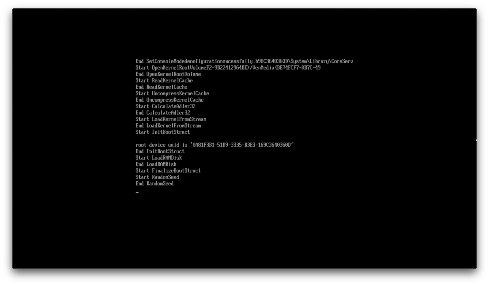
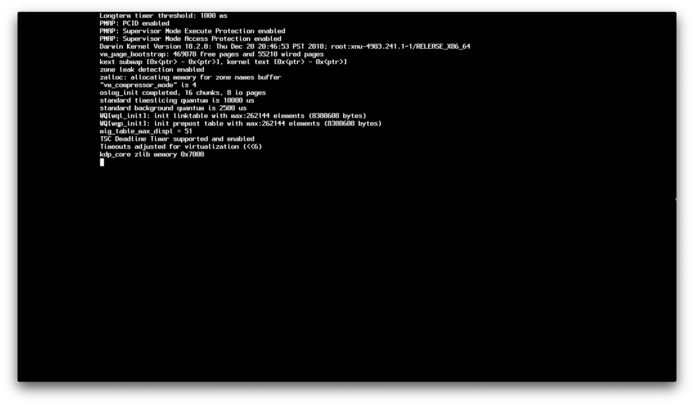
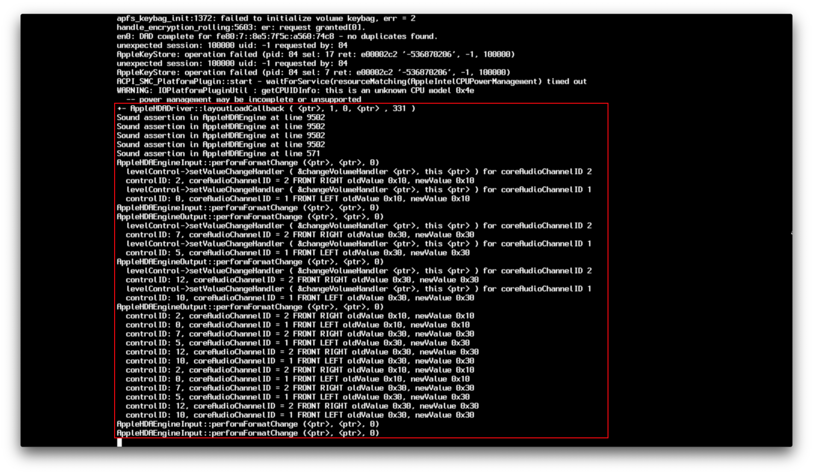
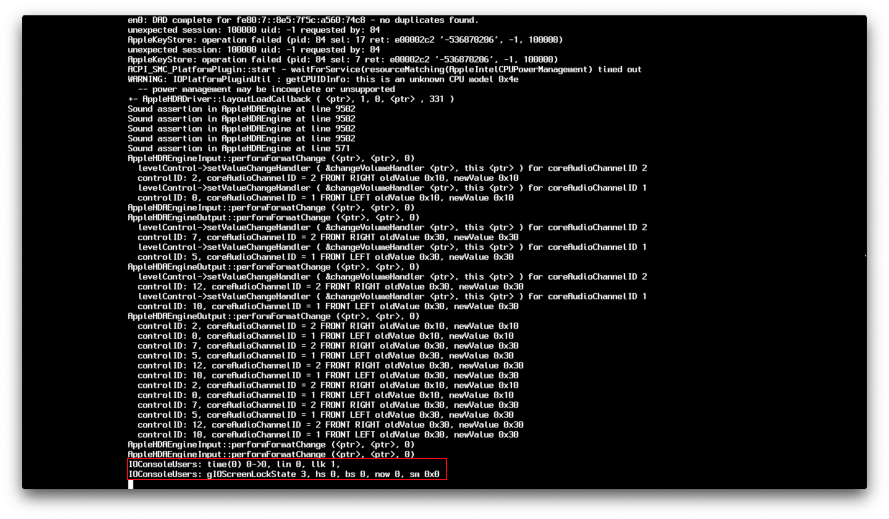

# Hiểu được quá trình boot của macOS

Với việc khắc phục sự cố hackintosh, nó sẽ có một chút khó khăn để hiểu được *nơi* mà bạn đang bị mắc kẹt lại khi từng những từ khoá mà bạn đang cố gắng tìm kiếm có thể không trùng với kết quả gì trên google. Tuy trang này sẽ không giúp bạn khắc phục tất cả các sự cố, ít nhất nó sẽ giúp bạn hiểu tốt hơn nơi mà quuas trình boot của macOS mà bạn đang mắc kẹt và hy vọng nó sẽ cho bạn thêm ý tưởng về việc sại sao bạn bị mắc kẹt.

## Quá trình boot OpenCore

Phần này sẽ ngắn gọn, vì vấn đề boot của OpenCore thường như hiếm và thường là các lỗi đơn giản:

* Hệ thống khởi động lên và tìm kiếm thiết bị boot
* Hệ thống xác định BOOTx64.efi trên USB OpenCore của bạn tại EFI/BOOT/
* BOOTx64.efi được khởi chạy và sẽ chạy OpenCore.efi từ EFI/OC/
* Tính chất của NVRAM được áp dụng
* Driver EFI được khởi chạy từ EFI/OC/Drivers
* Graphics Output Protocol(GOP) được cài đặt
* Bảng ACPI được khởi chạy từ EFI/OC/ACPI
* Thông tin SMBIOS được áp dụng
* OpenCore chạy và hiển thị cho bạn tất cả thiết bị để boot
* Bây giờ bạn có thể khởi chạy bộ cài đặt macOS của bạn

Nếu bạn gặp quá trình về boot tại thời điểm này, những thứ chính cần kiểm tra:

* [Mắc kẹt tại `no vault provided!`](./extended/opencore-issues.md#stuck-on-no-vault-provided)
* [Không thể nhìn thất phân vùng macOS](./extended/opencore-issues.md#can-t-see-macos-partitions)
* [Boot OpenCore khởi động lại về BIOS](./extended/opencore-issues.md#booting-opencore-reboots-to-bios)

Cho những vấn đề có thể xảy ra còn lại, xem:

* [OpenCore booting issues](./extended/opencore-issues.md)

## Handoff boot.efi



This is where macOS's bootloader(boot.efi) comes onto the scene, specifically what it does is prep the environment for the kernel to load and where OpenCore injects kexts. If you're getting stuck at this point, there's likely an issue with loading the kernel, main culprits:

* [Stuck on EndRandomSeed](./extended/kernel-issues.md#stuck-on-endrandomseed)
* [Stuck on `[EB|#LOG:EXITBS:START]`](./extended/kernel-issues.md#stuck-on-eb-log-exitbs-start)
* [`Couldn't allocate runtime area` errors](./extended/kernel-issues.md#couldn-t-allocate-runtime-area-errors)

Cho những vấn đề có thể xảy ra còn lại, xem:

* [Kernel Issues](./extended/kernel-issues.md)

**Lưu ý**: Trong macOS 10.15.4, Apple đã đổi phương thức sửa lỗi trong boot.efi, cho nên nó sẽ trông khác biệt chút so với trước nhưng chung quy là nó đều theo cùng một quy luật

## Handoff XNU/Kernel

Now that boot.efi has setup everything for us, we now get to watch the kernel do it's thing. This section is commonly referred as the [Rooting phase](https://developer.apple.com/library/archive/documentation/Darwin/Conceptual/KernelProgramming/booting/booting.html):



This section is where SMBIOS data is verified, ACPI tables/Kexts are loaded and macOS tries to get everything in order. Failures here are generally a result of:

* SSDT bị 
* Corrupted kexts(or incorrectly setup under your config.plist -> Kernel -> Add)
* Messed up memory map

See here for more troubleshooting info:

* [Kernel Panic `Cannot perform kext summary`](./extended/kernel-issues.md#kernel-panic-cannot-perform-kext-summary)
* [Kernel Panic on `Invalid frame pointer`](./extended/kernel-issues.md#kernel-panic-on-invalid-frame-pointer)


Now here we have `[ PCI configurations begin ]`, this section can be seen as a hardware test for our systems, kexts and SSDTs we injected, and where IOKit starts hardware probs to find devices to attach to.

The main things that are tested here:

* Embedded Controllers
* Storage(NVMe, SATA, etc)
* PCI/e
* NVRAM
* RTC
* PS2 and I2C

For more specific info on how to get around this area, see here:

* [Stuck on `RTC...`, `PCI Configuration Begins`, `Previous Shutdown...`, `HPET`, `HID: Legacy...`](./extended/kernel-issues.md#stuck-on-rtc-pci-configuration-begins-previous-shutdown-hpet-hid-legacy)


This is where the 15 port limit and USB mapping comes into play, and where the infamous "Waiting for Root Device" errors pops in, main things to check for:

* ["Waiting for Root Device" or Prohibited Sign error](./extended/kernel-issues.md#waiting-for-root-device-or-prohibited-sign-error)


This is where our FakeSMC/VirtualSMC come into the scene and do their magic, DSMOS itself is a kext that verifies if your system has an SMC and will request a key. If this key is missing, then DSMOS will not decrypt the rest of the binaries and you'll get stuck here. You may also get stuck at AppleACPICPU which is just the same error.

* [kextd stall[0]: AppleACPICPU](./extended/kernel-issues.md#kextd-stall-0-appleacpicpu)

```
Your karma check for today:
There once was a user that whined
his existing OS was so blind,
he'd do better to pirate an OS that ran great
but found his hardware declined.
Please don't steal Mac OS!
Really, that's way uncool.
(C) Apple Computer, Inc.
Tạm dịch:
Kiểm tra công việc của bạn hôm nay cho thấy:
Đã từng có người dùng than vãn rằng
hệ điều hành của anh ấy quá chậm chạp
anh ấy tốt hơn là trộm một hệ điều hành tuyệt vời
nhưng rồi phát hiện ra phần cứng bị từ chối.
Xin đừng ăn trộm Mac OS!
Thật đó, nó không thoải mái chút nào.
(C) Apple Computer, Inc.
```

Nguồn: Dont Steal Mac OS X.kext



Đây là nơi mà driver âm thanh của Apple vào, nơi sẽ làm AppleALC "sáng" lên. Chung là khá hiếm để thấy vấn đề ở đây nhưng nếu bạn gặp phải, thử huỷ kích hoạt AppleALC và những kext khác liên quan đến âm .



And here we get to the GPU driver initialization, and where WhateverGreen also does its magic. Generally errors here are due to the GPU and not WhateverGreen itself, main culprits:

* [Stuck on or near `IOConsoleUsers: gIOScreenLock...`](./extended/kernel-issues.md#stuck-on-or-near-ioconsoleusers-gioscreenlock-giolockstate-3)
* [Black screen after `IOConsoleUsers: gIOScreenLock...` on Navi](./extended/kernel-issues.md#black-screen-after-ioconsoleusers-gioscreenlock-on-navi)

## macOS Handoff


And you've finally got past all that verbose! If you're getting stuck at the Apple logo after all that verbose, then there's a couple things to check for:

* [macOS frozen right before login](./extended/kernel-issues.md#macos-frozen-right-before-login)
* [Black screen after `IOConsoleUsers: gIOScreenLock...` on Navi](./extended/kernel-issues.md#black-screen-after-ioconsoleusers-gioscreenlock-on-navi)
* [Frozen in the macOS installer after 30 seconds](./extended/userspace-issues.md#frozen-in-the-macos-installer-after-30-seconds)
